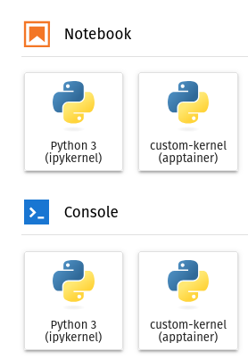

# Containerizing Jupyter Kernels

In this tutorial we'll look at how to use a containerized Jupyter kernel.
The first question one might have is why would we want to containerize a Jupyter kernel?
We're often faced with the problem of having complex dependencies that might be difficult to install on ones system.
For example, let's say we're using Windows or Mac OS but one of the packages we want to use is only available for Linux.
We have a few solutions:

* <b>Dual boot Linux</b>: This is when we split our computer's hard drive in two and install Linux on one side of the hard drive, with the original operating system remaining on the other. A downside of this is that we need to partition our hard drive, reducing the storage available to either partition. This is not something we can do on a shared system such as a high performance computing (HPC) cluster.

* <b>Virtual Machine (VM)</b>: In this setup we'd have a Linux virtual machine set up on the Window's system. This requires a full installation of the guest operating system (Linux), which can use a significant amount of storage space on the host's system. VMs also require resources (e.g. CPU, RAM, GPU) to be allocated to the VM. This means that those resources are no longer available to the host system's scheduler. For example if the VM is allocated 20% of the CPU allocation, and is sitting idle, the host system can only access 80% of the CPU allocation, despite the remaining 20% going unused. The availability of VMs on a shared system will be highly depended on the system.

* <b>100% containerized workflow</b>: With this option, we'd launch Jupyter hub from a container. This isn't a bad solution, but it doesn't allow for swapping between different kernels. Imagine we have a dependency that now only works in Windows and not Linux. We'd have to have two different Jupyter lab instances (one from the host system and one containerized) open to swap between different workflows. This could work in an HPC environment, however an HPC system will likely require such a job by queued in the system as normal job. This may require further layers of ssh-tunneling to go from a login node to an analysis node. HPC clusters which support Jupyter environments (for example [Digital Research Alliance of Canada](https://docs.alliancecan.ca/wiki/JupyterHub)) will typically have users interact with their Jupyter instance through a web portal, which uses a python environment based on python versions available on that cluster. 


The most promising and flexible solution is to use a containerized workflow.
However, it would be nice if we could use this containerized python environment within the preexisting JupyterHub web portal.
In this tutorial we'll do just that.


## Apptainer or Docker?

For this tutorial, we'll work in both Apptainer and Docker to show how this can be done using either containerization software.
For one's personal machine, it might be preferable to use Docker.
However, for HPC environments such as DRAC (Narval, Beluga, Cedar, Niagra) we'll use Apptainer.


## Let's build an Image

Let's build a simple small image with installs some python packages from a requirements file.
For this we'll use the Python 3.12-slim image (see [DockerHub](https://hub.docker.com/_/python)) as our base image.

We'll use the following `requirements.txt` file as our requirements:
```
numpy
matplotlib
scipy
ipykernel
ipython
```

### Docker image
```title="Dockerfile"
FROM python:3.12-slim

COPY ./requirements.txt /build/requirements.txt

RUN pip install -r /build/requirements.txt

CMD ["python"]
```
Which can be built with the tag `kernel` as:
```
docker build -t kernel .
```
### Apptainer image
```title="kernel.def"
Bootstrap: docker
From: python:3.12-slim

%files
    ./requirements.txt /build/requirements.txt

%post
    pip install -r /build/requirements.txt

%runscript
    python
```
Which can be built to the file `kernel.sif` as:
```
apptainer build kernel.sif kernel.def
```


## Installing a custom kernel

Now that we have our image created, let's create a custom Jupyter kernel.
```
python -m ipykernel install --user --name custom-kernel --display-name="custom-kernel"
```
Which installs the kernel in my home directory, e.g.:
```
Installed kernelspec custom-kernel in /home/obriens/.local/share/jupyter/kernels/custom-kernel
```
Creating the `kernel.json` file (`/home/obriens/.local/share/jupyter/kernels/custom-kernel/kernel.json`):
```
{
 "argv": [
  "/home/obriens/miniforge3/bin/python",
  "-m",
  "ipykernel_launcher",
  "-f",
  "{connection_file}"
 ],
 "display_name": "custom-kernel",
 "language": "python",
 "metadata": {
  "debugger": true
 }
}
```

We want to modify this file with our containerized kernel:

### Docker
```
{
 "argv": [
     "docker",
     "run",
     "--network=host",
     "--rm",
     "-v",
     "{connection_file}:/connection_file",
     "kernel",
     "python",
     "-m",
     "ipykernel_launcher",
     "-f",
     "/connection_file"
 ],
 "display_name": "custom-kernel (docker)",
 "language": "python",
 "metadata": {
  "debugger": true
 }
}
```
Note that we pass the keyword `--network=host`, and we're mounting the `{connection_file}` from the host to `/connection_file` within the container.


### Apptainer
```
{
 "argv": [
     "apptainer",
     "exec",
     "--bind",
     "{connection_file}:/tmp/connection_file",
     "/path/to/kernel.sif",
     "python",
     "-m",
     "ipykernel_launcher",
     "-f",
     "/tmp/connection_file"
 ],
 "display_name": "custom-kernel (apptainer)",
 "language": "python",
 "metadata": {
  "debugger": true
 }
}
```

Note we're binding `{connection_file}` from the host to `/connection_file`

## Launching the custom kernel

With the image created, the kernel installed and `kernel.json` modified, we can now launch a Jupyter lab instance and connect to the kernel using (feel free to use any custom options such as the instance port):
```
jupyter lab
```
Now we can access the launcher by clicked the "New Launcher" button or pressing Ctrl + Shift + L:

<figure markdown>
  { width="250" }
  <figcaption> Launch Button </figcaption>
</figure>


Once pressed, we can see an option to launch a Notebook or Python console using our custom kernel:

<figure markdown>
  { width="250" }
  <figcaption> Custom kernels in Jupyter lab </figcaption>
</figure>


If we're using the Docker kernel, then we can monitor the container using any of the standard methods we'd use for monitoring docker containers, for example:
```
docker ps
```
```
CONTAINER ID   IMAGE                     COMMAND                  CREATED              STATUS              PORTS                                         NAMES
0c39ccf064d0   obriens/kernel:latest     "python -m ipykernel…"   About a minute ago   Up About a minute                                                 determined_chatelet
```
Or to read the logs of that container:
```
docker logs 0c39ccf064d0
```
```

NOTE: When using the `ipython kernel` entry point, Ctrl-C will not work.

To exit, you will have to explicitly quit this process, by either sending
"quit" from a client, or using Ctrl-\ in UNIX-like environments.

To read more about this, see https://github.com/ipython/ipython/issues/2049


To connect another client to this kernel, use:
    --existing /connection_file
```
If we shut down the kernel from Jupyter lab (Kernel->Shut Down All Kernels), you'll notice that the container is deleted upon shut down (`docker ps`). 

## Some Peculiarities

### Number of Containers

If we launch multiple notebooks within Jupyter lab, we'll have multiple containers spawned, for example with 4 notebooks:
```
docker ps
```
```
CONTAINER ID   IMAGE                     COMMAND                  CREATED          STATUS          PORTS                                         NAMES
6830bcd6b669   obriens/kernel:latest     "python -m ipykernel…"   32 seconds ago   Up 31 seconds                                                 competent_zhukovsky
bcec50f54eed   obriens/kernel:latest     "python -m ipykernel…"   34 seconds ago   Up 34 seconds                                                 recursing_noether
c64e9ab35482   obriens/kernel:latest     "python -m ipykernel…"   38 seconds ago   Up 37 seconds                                                 blissful_solomon
20bc592ceb4c   obriens/kernel:latest     "python -m ipykernel…"   41 seconds ago   Up 41 seconds                                                 boring_ardinghelli
```

This might be the desired behavior, however having an individual container for each instance might be very memory and resource consuming. Instead, we could start an instance of some container and then attach any new kernels to that container instead. For this we need to create some "daemon" that will keep the container process alive. Let's modify the `Dockerfile` to create an infinite process:
```
FROM python:3.12-slim

COPY ./requirements.txt /build/requirements.txt

RUN pip install -r /build/requirements.txt
RUN echo "#!/bin/bash\nwhile true; do sleep 1; done" >> /build/keep_alive.sh ; chmod a+x /build/keep_alive.sh 

CMD ["/build/keep_alive.sh"]
```

Here we're creating a script called `/build/keep_alive.sh`. This scrip contains a while loop that will loop `while true`, i.e. until terminated and then simply sleep for 1 second.

!!! info "Aside on `docker stop`"

    Note: When running `docker stop`, Docker will send a `SIGTERM` signal to the process and wait, by default, 10 seconds before sending a `SIGKILL` signal. We can keep this in mind when setting the sleep time. If the sleep time is > 10 seconds then the process will be killed. If < 10 seconds then the process will attempt to gracefully terminate. This can help prevent data coruptions by ensuring files are properly closed or clean up any child processes managed by this instance. This is something to keep in mind when designing your image. 


We then set the start script to be `/build/keep_alive.sh`, so that when we start this container, it will default to this script and run until interrupted.

Next we need to create a start script that we'll call when trying to start/restart a Jupyter kernel:
```bash title="launch_docker.sh"
#!/bin/bash

# Get the filename of the connection file
connection_file=$(basename $1)
container_name="server"
image_name="obriens/kernel:latest"

# Check if the server is currently runnong
if [ "$( docker container inspect -f '{{.State.Running}}' $container_name )" = "true" ]; then
    echo "Server is running"
else
    # if not then start the server
    echo "Starting the server"
    # Get the path of where the connection files will be stored
    connection_path="$(jupyter --runtime-dir)"
    # Stop and remove the container if it already exists
    docker stop $container_name
    docker rm $container_name
    # Create a new container
    # Add it to the host network and mounting the connection_path
    docker create --name=$container_name -v  $connection_path:/connections --network=host  $image_name
    # Start this server instance
    docker start  $container_name
fi

# Launch a ipykernel using the connection file that was passed as arg 1
docker exec  $container_name python -m ipykernel_launcher -f /connections/$connection_file
```

We can then make this executable with:
```
chmod +x launch_docker.sh
```

Finally, we can modify the `kernel.json` file to call this script:
```
{
 "argv": [
     "/path/to/launch_docker.sh",
     "{connection_file}"
 ],
 "display_name": "custom-kernel (docker)",
 "language": "python",
 "metadata": {
  "debugger": true
 }
}
```

With this new `kernel.json` file and `launch_docker.sh` in place, we can now relaunch `jupyter lab` and open multiple notebooks. 
If we now check the containers that we have running with `docker ps`:
```
CONTAINER ID   IMAGE                     COMMAND                  CREATED          STATUS          PORTS                                         NAMES
e2a7475eb14f   obriens/kernel:latest        "/build/keep_alive.sh"   15 minutes ago   Up 15 minutes                                                 server
```
We can see that only one kernel is running.

The container can be stopped at any time with:
```
docker stop server
```
And removed with:
```
docker rm server
```

One downside is that we'll need to manually stop the container once we're finished.

#### What about Apptainer

Similarly, we can limit the number of Apptainer containers by starting our container as an `instance` and then connecting to that instance.
Apptainer doesn't require a daemon script (like `/build/keep_alive.sh`), so we don't need to modify the image.
Let's use the following script to launch the Apptainer instance:
```bash
#!/bin/bash

# Get the filename of the connection file
connection_file=$(basename $1)
container_name="server"
image_name="/path/to/kernel.sif"
# Check if the server instance is currently running
if [ $(apptainer instance list $container_name | wc | awk '{print $1}') -ge 2 ]; then
    echo "Server is running"
else
    # if it isn't start an instance
    echo "Starting the server"
    # Bind the runtime-dir (where the connection files are) to /connections within the container
    apptainer instance start --bind `jupyter --runtime-dir`:/connections $image_name $container_name
fi

# Attach and run ipykernel_laucher
apptainer exec instance://$container_name python -m ipykernel_launcher -f /connections/$connection_file
```

The instance can be stopped with
```
apptainer instance stop server 
```

### Networking and Port mapping

You might have noticed that we didn't need to pass any ports to the docker image. 
Instead, we simply add the container to the `host` network. 
In this set up, all the communication between the container and Jupyter lab is handled through the `host` network, with the Jupyter instance itself handling the ports being used.

In contrast to launching a Jupyter instance from within a container, we don't actually need to know what ports should be mapped within the container.
This greatly simplifies the setup, instead allowing ports to be determined at launch, without the need to reconfigure a run command of a docker-compose file.


<script id="MathJax-script" async src="https://cdn.jsdelivr.net/npm/mathjax@3/es5/tex-mml-chtml.js"></script>