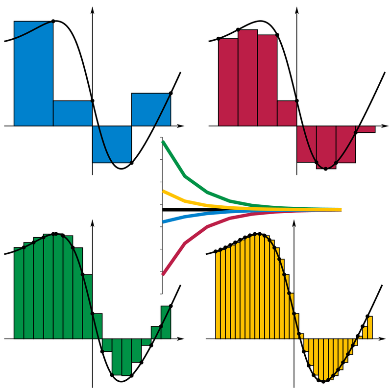

# Introduction to Parallel Programming in C++ with OpenMP


## Introduction to OpenMP in C++

In this tutorial, I aim to introduce you to OpenMP, a library facilitating multiprocessing in C++. I assume little-to-no background in computer science or low-level programming, and only a basic understanding of C++. I will steer clear of technical jargon wherever possible. Many online resources presume you are a seasoned programmer or computer scientist. Instead, I assume that you utilize programming as a tool and prioritize the "how" over the "why". However, for those interested in the rationale behind concepts, I will include some links at the bottom for further reading.

If you are an experienced programmer, you might notice some terminology that may seem imprecise. For instance, when using `shared` and `private`, I refer to "copy" instead of delving into references and mutability intricacies. As mentioned, this tutorial caters to learners seeking to grasp concepts and initiate coding rather than the theoretical computer science underpinning these concepts.


Worried about setting up your environment correctly? Want to just run the examples here? These examples can be run from a [docker image](./docker.md), see [here](https://hub.docker.com/repository/docker/obriens/parallel/) for the latest image. 
```
docker run -it --rm --gpus all obriens/parallel:latest 
``` 

## How to Calculate $\pi$

## Calculating π using a Riemann Sum Approximation

To determine the value of π, we can solve the following integral:

$$ \pi = \int_0^1 \frac{4}{1+x^2} \,dx. $$

An approximation of this integral can be made using a Riemann Sum, also known as the "rectangle rule," defined as:

$$ S = \sum_{i=1}^{n} f(x^*_i) \, \Delta x, $$

where:

* $n$ represents the number of "rectangles."
* $f(x^*_i)$ denotes a point within the range $(x_{i-1}, x_{i})$.
* $\Delta x = x_{i} - x_{i-1}$ represents the width of each rectangle.
* $f(x^*_i)$ is the function to approximate at $x^*_i$.

Within this summation, the calculation involves finding the area of a rectangle with width $\Delta x$ and height $f(x^*_i)$. Determining the value of $n$ allows full coverage of the entire integral domain by summing rectangles of width $\Delta x$.

For instance, in the case of approximating π using 100 steps ($ n = 100 $), the width is calculated as $\Delta x = \frac{(b - a)}{n} = \frac{(1 - 0)}{100} = 0.01$.

 

<!-- <figure markdown>
    
  <figcaption>Riemann sum example. [Image credit](https://en.wikipedia.org/wiki/Riemann_sum) </figcaption>
</figure> -->

<figure markdown>
  { width="500" }
  <figcaption> Riemann sum example. (https://en.wikipedia.org/wiki/Riemann_sum) </figcaption>
</figure>


## Estimating π using Riemann Sum

To estimate the value of π, we can use the following formula:

$$ \pi \approx \sum_{i=1}^{n} \frac{4}{1+((i+0.5)*\Delta x)^2} \, \Delta x. $$

Here, we define $x^*_i$ as the midpoint between $x_{i-1}$ and $x_{i}$. As $n \rightarrow \infty$, the estimation becomes independent of how we define $x^*_i$.

In C++, the approximation formula would look something like this:

```c++ title="calc_pi_serial" linenums="1" hl_lines="4 6-7 9"
double calc_pi_serial (int num_steps){ 
    int i; 
    double x, pi, sum = 0.0;
    double step = 1.0/(double) num_steps;
    for ( i=0; i< num_steps; i++){
        x = (i+0.5)*step;
        sum = sum + 4.0/(1.0+x*x);
    }
    pi = step * sum;
    return pi;
}

```

On line 4, we utilize the requested number of steps (`num_steps`) to define `step`, which represents $\Delta x$. Note that we "cast" the `int` `num_steps` to a `double` type in the division. 

Moving to line 6, we determine $x^*_i$ as the midpoint between $x_{i-1}$ and $x_{i}$ before adding the current iteration to the total.

Finally, on line 9, we multiply the `sum` by `step`, thereby calculating the area of the rectangle. As $\Delta x$ remains constant, we can optimize the code by taking this operation out of the loop.

Before evaluating the code's performance, let's include some useful libraries.

Example:

``` c++ 
#include <iostream>
#include <chrono>
```

In this implementation, we'll utilize `iostream` along with `cout` for printing the results. Additionally, we will employ `chrono` to measure the time taken for the code execution. 

Combining these libraries together, we get the following:


``` c++ title="calculate_pi.cpp" linenums="1" hl_lines="21-22 28-30"
#include <iostream>
#include <chrono>

// Function to calculate pi
double calculate_pi (int num_steps){
    int i;
    double x, pi, sum = 0;
    double step = 1./ (double) num_steps;

    for (i = 0; i < num_steps; i++){
        x = (i+0.5)*step;
        sum = sum + 4.0/(1.0+x*x);
    }
    pi = sum * step;
    return pi;
}

int main(){

    // 1 million steps
    int num_steps = 1000000;
    int n_repeat = 50;

    // mean pi value
    double serial_pi = 0;

    // Run timer
    auto start_time = std::chrono::high_resolution_clock::now();
    for (int i = 0; i < n_repeat ; i ++) serial_pi += calculate_pi(num_steps);
    auto end_time = std::chrono::high_resolution_clock::now();
    
    std::chrono::duration<double> serial_duration = end_time - start_time;

    // Print average results
    std::cout << "Serial Calculation of Pi: " << serial_pi / n_repeat 
              << std::endl << "Duration: " << serial_duration.count() / n_repeat << " seconds" << std::endl;

}

```

Lines 21 and 22 involve defining `num_steps` as 1 million and `n_repeat` as 50. This setup allows us to repeat the calculation of $\pi$ 50 times, considering the mean run time as our performance metric.

Moving to lines 28-30, we initiate a timer, execute the function 50 times, and subsequently stop the timer, calculating the duration on line 32. Finally, we present the mean results.

Upon compiling this example and running it, the observed output is:


``` 
Serial Calculation of Pi: 3.14159 
Duration: 0.00263172 seconds 
``` 


An execution time of 0.003 seconds doesn't sound too bad, providing us with an accurate estimation of $\pi$. However, it would be beneficial to explore how we can further enhance the speed of this code.

To leverage parallel execution, we must reconsider our algorithm. This involves identifying which sections can be executed in parallel and which sections must remain in serial execution. Let's establish this as our baseline. The speedup factor is defined as:


$$ 
\mathrm{speed~up} = \frac{\mathrm{baseline~runtime}}{\mathrm{test~runtime}} 
$$ 

 
## Poorly Parallelized Code 

Examining the `calc_pi_serial` function, we observe a substantial loop that appears to be a promising candidate for parallelization. Our initial step will involve optimizing this for loop to execute across multiple threads.

 

!!! info "Defining a parallel scope"
    - To define a parallel scope or a block of code to run in parallel, we are going to use openMP. First we will include the openMP library:
    ```c++
    #include<opm.h>
    ```
    - Once we identify the area of the code to run in parallel, we define a new ``scope'' for that section
    ```c++
    // Define a parallel block of code
    #pragma omp parallel
    {
        // Code we want to run in parallel
        ...
    }
    ```
    - In this example we will be using a fixed number of threads that we know at compile time. On Linux we can identify how many CPU cores we have access to using `lscpu`: 
    ```
    lscpu
    ...
    CPU(s):                  16
      On-line CPU(s) list:   0-15
    ...
    ```
    Here I have access to 16 cores. I will therefore define a constant in my code equal to the number of cores: 
    ```c++
    #define NUM_THREADS 16
    ```

Here is my initial (incorrect) attempt at a parallel version for calculating $\pi$:

```c++ title="calculate_pi_wrong" linenums="1" hl_lines="4 6 7 10 11"
double calculate_pi_wrong (int num_steps){
    double x, pi, sum = 0;
    double step = 1./ (double) num_steps;
    int chunks = num_steps / NUM_THREADS;

    omp_set_num_threads(NUM_THREADS);
    #pragma omp parallel
    {
        int i;
        int id = omp_get_thread_num();
        for (i = id*chunks; i < (id+1)*chunks; i++){
            x = (i+0.5)*step;
            sum = sum + 4.0/(1.0+x*x);
        }
    }
    
    pi = sum * step;
    return pi;
}
```

At line 4, we define `chunks`, representing the number of iterations that will occur on each thread. Subsequently, on line 6, `omp_set_num_threads(NUM_THREADS)` is utilized to specify the number of threads to be invoked.

Moving to line 7, we establish a parallel block spanning from line 8 to line 15. Within this block, on line 10, `omp_get_thread_num()` retrieves the thread ID for the currently executing thread. Following that, line 11 introduces a loop specifically iterating over the steps assigned to each thread.

To compile, it's necessary to use the `-fopenmp` flag. For instance:
 
```bash
g++ mycode.cpp -o mycode -fopenmp
```
Running the code, produces the get the following result:
```
Parallel (Wrong) Calculation of Pi: 0.297578
Duration: 0.00838327 seconds (0.313425 speed up) 
```
If we rerun the code, we also see:
```
Parallel (Wrong) Calculation of Pi: 0.283952
Duration: 0.00774014 seconds (0.338872 speed up) 
```

Our parallel implementation takes longer to execute than the serial example, and it also computes an incorrect value for $\pi$. Additionally, the calculated value of $\pi$ is not reproducable. Let's delve deeper into understanding the code's behavior...


!!! info "What went wrong"


    In the initial setup, we define several variables within the "parent scope" to be utilized within the parallel section of the code. However, these variables are accessed and modified in parallel, leading to read and write operations occurring simultaneously at lines 12-13.
    ```c++ title="calculate_pi_wrong" linenums="1" hl_lines="2-3 12-13"
    double calculate_pi_wrong (int num_steps){
        double x, pi, sum = 0;
        double step = 1./ (double) num_steps;
        int chunks = num_steps / NUM_THREADS;

        omp_set_num_threads(NUM_THREADS);
        #pragma omp parallel
        {
            int i;
            int id = omp_get_thread_num();
            for (i = id*chunks; i < (id+1)*chunks; i++){
                x = (i+0.5)*step;
                sum = sum + 4.0/(1.0+x*x);
            }
        }
        
        pi = sum * step;
        return pi;
    }
    ```
    Running in parallel, all threads attempt to read from/write to the `sum` variable without control or predictability regarding which thread modifies the `sum` value. Threads accessing and modifying `sum` concurrently can lead to unexpected behavior. For instance, consider that on iteration 1, thread 1 takes `sum` as 0 and modifies it. Concurrently, thread 2 attempts the same, leading to different values being written to the same variable. Consequently, the calculation of `sum` becomes unreliable due to this simultaneous access.


    This issue, known as a [race condition](https://en.wikipedia.org/wiki/Race_condition), arises as the code outcome depends on the order in which threads access data.

    Let's look at how we may solve this issue...


## Solving the Race Condition using an array


To resolve the race condition, ensuring that only one thread accesses a variable at any given time is essential. For this purpose, we require a variable accessible to all threads yet controllable by a main thread for summation. An effective solution involves employing an array of size `NUM_THREADS`.


```c++ title="calculate_pi_correct" linenums="1" hl_lines="4 14 17 20 25"
double calculate_pi_correct (int num_steps){

    double pi = 0.0;
    double sum [NUM_THREADS];
    double step = 1.0/(double) num_steps;
    int chunks = num_steps / NUM_THREADS;

    // Set up the parallel loop
    omp_set_num_threads(NUM_THREADS);
    #pragma omp parallel
    {
        // get the thread id
        int i, id;
        double x;
        id = omp_get_thread_num();
        // Each thread sums over its own chunk
        for ( i=id*chunks, sum[id]=0; i < (id+1)*chunks; i++){
            x = (i+0.5)*step;
            // Sum over each's own sum counter
            sum[id] += 4.0/(1.0+x*x);
        }
    }

    // Combine in serial
    for (int i = 0; i < NUM_THREADS; i++) pi += step * sum[i];
    return pi;

}    

```
At line 4, a `double` array of size `NUM_THREADS` is initialized. On line 14, the variable `x` is localized for each thread. Moving to line 17, a loop iterates through each section for every thread, setting `sum[id]` to 0 for each thread. Then, at line 20, modification occurs solely within the thread's respective entry in the array. Finally, on line 25, the aggregated list is combined.

Upon compilation and execution, the observed outcome is:

``` 
Parallel (Correct) Calculation of Pi: 3.14159 
Duration: 0.00562214 seconds (0.466534 speed up)  
``` 


Although we accurately estimate $\pi$ with reproducible results, there's no observed enhancement in runtime. To comprehend this, scrutiny of lines 4, 17, and 20 is necessary.

We've defined `sum` as a `double` array of size `NUM_THREADS`. In memory, `sum` refers to a contiguous block of memory. Loading `sum` into our cache requires the passing of `sum` between threads. Consider threads A and B: when `sum` enters the cache, it occupies a "cache line," awaiting CPU utilization. Both threads attempt to access `sum`. While thread A successfully accesses `sum`, thread B encounters a "cache miss," leading to a delay. This issue can be addressed by incorporating knowledge of CPU and cache behavior into our data type design.


### Pading our Array
<!-- See aside on [optimizing cache usage](./optimize-cache.md). -->


Understanding our cache design allows us to optimize how data is organized, resulting in improved performance. One method for this optimization is known as "padding". By employing padding, we introduce additional, redundant information to ensure that our data is stored within the same cache line.

In the context of the aforementioned example, we can implement padding for the `sum` array by transforming it into a 2D array with dimensions `NUM_THREADS`$\times64$. But why 64? To understand this, let's examine our CPU:


``` 
> cat /proc/cpuinfo| grep cache 
cache size : 512 KB 
cache_alignment : 64 
``` 
Imagine the cache as a traffic stop with 64 lanes. When the traffic light turns green, 64 cars pass before it turns red again. Subsequently, the next row gets the green light, and so forth.

How does this analogy apply to us? When we read from the cache, our aim is to minimize how often we access an array. If we solely require one row of an array, one cache line suffices. To achieve this, we pad our row with 63 other non-essential pieces of information. Subsequently, the second read will access the second row, which is on the subsequent "row of traffic".

We design our array to leverage the cache's ability to read 64 elements of a row at once. The following example demonstrates the implementation of this strategy:


```c++ title="calculate_pi_padded" linenums="1" hl_lines="4 17 20 25"
double calculate_pi_padded (int num_steps){

    double pi = 0.0;
    double sum [NUM_THREADS][PAD];
    double step = 1.0/(double) num_steps;
    int chunks = num_steps / NUM_THREADS;

    // Set up the parallel loop
    omp_set_num_threads(NUM_THREADS);
    #pragma omp parallel
    {
        // get the thread id
        int i, id;
        double x;
        id = omp_get_thread_num();
        // Each thread sums over its own chunk
        for ( i=id*chunks, sum[id][0]=0; i < (id+1)*chunks; i++){
            x = (i+0.5)*step;
            // Sum over each's own sum counter
            sum[id][0] += 4.0/(1.0+x*x);
        }
    }

    // Combine in serial
    for (int i = 0; i < NUM_THREADS; i++) pi += step * sum[i][0];
    return pi;

}
```
This example is similar to the previous version; however, we can see on line 4 we define `sum` as a 2D `double` array. On lines 17, 20 and 25, we are only accessing the 0$^{th}$ element of each row.  

``` 
Parallel (Padded) Calculation of Pi: 3.14159 
Duration: 0.00167924 seconds (1.56197 speed up)  
``` 

Success! We observe a 1.56x improvement in performance. While this approach isn't memory-efficient, it demonstrates how organizing our data can significantly enhance performance.
 
## Using a Locking Construct

So far, we have tried to solve the race condition issue by increasing the memory requirement. We can also use a construct to control the order in which threads can access a section of the code.  


!!! info "Using constructs"
    OpenMP has several constructs that we can use in our code to modify a thread's flow. See [here](http://www.plutospin.com/files/OpenMP_reference.pdf) for a useful cheat sheet. 

    - Thus far, we've encountered the `parallel` construct, defining a code section to run in parallel:
    ```c++
    #pragma omp parallel
    {
        // Code to be ran in parallel
        ...
    }
    ```

    - The `master` construct designates a code section to execute on a single thread, identified as the "master" or main thread.
    ```c++
    #pragma omp parallel
    {
        // Code running on all threads
        a += 1;

    
        #pragma omp master
        {
            // Code only running on one thread
            b += 1;
        }
    }
    
    ```

    - A `barrier` construct synchronizes threads, ensuring that all threads reach the same point before proceeding.
    ```c++
    #pragma omp parallel
    {
        // Code running on all threads
        a += 1;

        // Waiting until all threads reach this point
        #pragma omp barrier
        b += 1;
    }
    ```

    - The `sections` construct specifies distinct code sections to execute in parallel across various threads.
    ```c++
    // Start of sections block
    omp_get_thread_num(2);
    #pragma omp sections
    {
        // Section 1
        #pragma omp section
        {
            a+=1;
        }
        // Section 2
        #pragma omp section
        {
            b+=1;
        }
    }
    ```
    - Furthermore, the behavior of a construct can be modified using "directives".
    ```c++
    #pragma omp parallel private (a) shared (b)
    {
        a += b;
    }
    
    ```
    In the provided code, we modified the behavior of the `parallel` construct. Each thread now carries a "private" copy of `a` and shares a copy of `b`. Changes to `a` are confined to the thread locally, while modifications to `b` affect all threads uniformly.

Let us modify the `calculate_pi_correct` example to use constructs to improve the performance.

``` c++ title="calculate_pi_critical" linenums="1" hl_lines="6 10 24 27"
double calculate_pi_critical (int num_steps){

    double pi = 0.0;
    double step = 1.0/(double) num_steps;
    int chunks = num_steps / NUM_THREADS;
    double sum, x;

    // Set up the parallel loop
    omp_set_num_threads(NUM_THREADS);
    #pragma omp parallel private(sum, x) shared (pi)
    {
        // get the thread id
        int i, id;
        id = omp_get_thread_num();
        // Each thread sums over its own chunk
        for ( i=id*chunks, sum=0; i < (id+1)*chunks; i++){
            x = (i+0.5)*step;
            // Sum over each's own sum counter
            sum += 4.0/(1.0+x*x);
        }
        
        // Use a critical barrier
        // Only one thread at a time
        #pragma omp critical
        pi += step * sum;

    }
    return pi;

}    
```

In the above code, variables `pi`, `sum`, and `x` are defined outside the loop, making them accessible to all sub-scopes. We use the `private` and `shared` directives. This gives each thread a private copy of `sum` and `x`, and a shared copy of `pi`. This is shown on line 10.

With this adjustment, concerns about moving around `sum` and `x` are eliminated since each thread possesses its own copy. However, caution is necessary regarding how threads modify `pi`. To address this, we employ a `critical` construct, designating a code region accessible to only one thread at a time.


The utilizating the `critical` construct on line 24 acts as a "lock", effectively halting other threads from progressing beyond this code section. Once a thread completes the addition operation and moves to line 27, the scope ends, releasing the "lock" and enabling the subsequent thread to enter this part of the code.

`critical` constructs serve a valuable purpose in managing thread access when modifying shared data accessible to all threads.


``` 
Parallel (Critical) Calculation of Pi: 3.14159 
Duration: 0.00025696 seconds (10.2075 speed up)  
``` 


We are now observing a tenfold ($\times10$) enhancement over the baseline test. Through refining the management of variable passing and controlling access using constructs, we've significantly enhanced our code.


## Using an Atomic Construct

You might be familiar with `atomic` data types—these are data types that automatically trigger a lock whenever a read/write operation is executed on them. In OpenMP, we utilize an `atomic` construct to segment a section of the code where we perform such `atomic` operations.


```c++ title="calculate_pi_atomic" linenums="1" hl_lines="24"
double calculate_pi_atomic (int num_steps){

    double pi = 0.0;
    double step = 1.0/(double) num_steps;
    int chunks = num_steps / NUM_THREADS;
    double sum, x;

    // Set up the parallel loop
    omp_set_num_threads(NUM_THREADS);
    #pragma omp parallel private(sum, x) shared(pi)
    {
        // get the thread id
        int i, id;
        id = omp_get_thread_num();
        // Each thread sums over its own chunk
        for ( i=id*chunks, sum=0; i < (id+1)*chunks; i++){
            x = (i+0.5)*step;
            // Sum over each's own sum counter
            sum += 4.0/(1.0+x*x);
        }
        
        // Use an atomic barrier
        // Only one thread at a time can modify
        #pragma omp atomic
        pi += step * sum;

    }
    return pi;

}    
```


The main distinction between `calculate_pi_critical` and `calculate_pi_atomic` lies on line 24, where an `atomic` construct replaces the `critical` construct. When utilizing an `atomic` construct, the subsequent operation is treated as `atomic`, triggering a lock during read/write operations.

```
Parallel (Atomic) Calculation of Pi: 3.14159
Duration: 0.000249191 seconds (10.5257 speedup) 
```
We notice a slight improvement; however, this improvement might just be noise. It's crucial to recognize that atomic operations (`++`, `--`, `+`, `*`, `-`, `/`, `&`, `^`, `<<`, `>>`, `|`) are limited and can only be applied to primitive data types (e.g., `int`, `float`, `double`). While atomic constructs are useful, they are less versatile compared to critical constructs.


## Using a Reduction


Operations such as summations and products are frequently encountered. In fact, many of these operations can be executed using constructs and directives available in OpenMP. The `reduction` directive serves the purpose of indicating to the code that a variable is the result of a well-known operation. The compiler will then handle the necessary tasks, including ensuring memory safety, optimization, and more.

```c++ title="calculate_pi_reduction" linenums="1" hl_lines="11"
double calculate_pi_reduction (int num_steps){

    double pi = 0.0;
    double step = 1.0/(double) num_steps;
    int i;
    double sum = 0;
    double x;

    // Set up the parallel loop
    omp_set_num_threads(NUM_THREADS);
    #pragma omp parallel for reduction (+:sum) private (x)
    for ( i=0; i < num_steps; i++){
        x = (i+0.5)*step;
        // Sum over each's own sum counter
        sum += 4.0/(1.0+x*x);
    }

    pi = step * sum;

    return pi;

}    
```


All the previous steps have been consolidated into one line, specifically line 11. Here, we instruct the compiler that within a `for` loop, we intend to execute a well-known `reduction` operation, specifically adding multiple values to the variable `sum` (`(+:sum)`). Additionally, we specify that each thread requires a private copy of `x`. This approach eliminates the necessity for `critical` or `atomic` constructs, as the compiler handles these complexities on our behalf.

```
Parallel (Reduction) Calculation of Pi: 3.14159
Duration: 0.000212785 seconds (12.3266 speed up) 
```

We observe a  $\times 12$ enhancement in execution speed.

## Summary
```
Serial Calculation of Pi: 3.14159
Duration: 0.00262292 seconds
Parallel (Wrong) Calculation of Pi: 0.283952
Duration: 0.00774014 seconds (0.338872 speed up) 
Parallel (Correct) Calculation of Pi: 3.14159
Duration: 0.00562214 seconds (0.466534 speed up) 
Parallel (Padded) Calculation of Pi: 3.14159
Duration: 0.00167924 seconds (1.56197 speed up) 
Parallel (Critical) Calculation of Pi: 3.14159
Duration: 0.00025696 seconds (10.2075 speed up) 
Parallel (Atomic) Calculation of Pi: 3.14159
Duration: 0.000249191 seconds (10.5257 speed up) 
Parallel (Reduction) Calculation of Pi: 3.14159
Duration: 0.000212785 seconds (12.3266 speed up) 
```

When comparing the baseline to optimal code, we only need an additional 4 lines of code:
```c++
#include<opm.h>
...
#define NUM_THREADS 16
...
    omp_set_num_threads(NUM_THREADS);
    #pragma omp parallel for reduction (+:sum) private (x)
...
```


OpenMP equips us with pre-existing "constructs" and "directives" that facilitate the development of high-performing code. This allows us to emphasize the code's functionality rather than dwelling extensively on optimization techniques.

Even for more generic code that cannot utilize `atomic` or `reduction`, significant performance enhancements can still be achieved by modestly rethinking how our algorithms operate.

In this example, our focus has been exclusively on CPUs. The code utilized in this demonstration is available on [GitHub](https://github.com/steob92/parallel-cplusplus).

<!-- [How could this work with GPUs](./parallel-gpu.md)?   -->