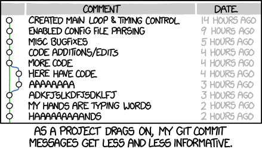
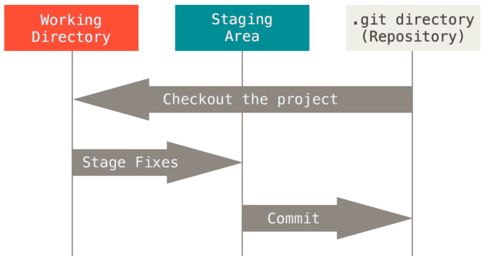
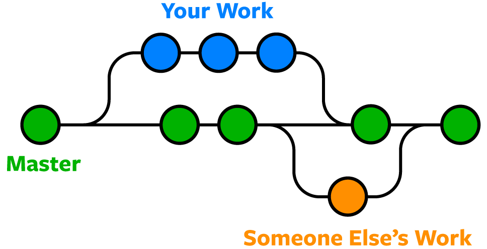

# Git Basics: Version Control for Research Workflows

## What is Version Control?

**Version control** is a system that tracks and manages changes to files over time. It allows you to:

- **Track history**: See what changed, when, and why
- **Revert changes**: Go back to previous versions if something breaks
- **Collaborate**: Multiple people can work on the same project simultaneously
- **Understand context**: Commit messages document the "why" behind changes

Imagine you're writing a paper and you save versions like: `paper_v1.docx`, `paper_v1_revised.docx`, `paper_v1_final.docx`, `paper_v1_FINAL_ACTUAL.docx`. Version control automates this and makes it sane.

<figure markdown>
  {: style="height:300px;width:500px"}
  <figcaption>Why version control matters (source: <a href="https://xkcd.com/1296/">xkcd #1296</a>)</figcaption>
</figure>

## Distributed Version Control with Git

**Git** is a distributed version control system, meaning:

- Every developer has a complete copy of the project history on their machine
- No single point of failure (unlike centralized systems)
- You can work offline and sync later
- Multiple developers can work on the same codebase without interfering

### Key Concepts

**Repository (Repo)**: A folder containing your project and its entire history.

**Commit**: A snapshot of your project at a point in time, with a message explaining what changed.

**Branch**: A parallel version of your code. You can work on features independently without touching the main branch.

**Remote**: A version of your repository hosted elsewhere (e.g., GitHub).

**Push/Pull**: Push sends your local changes to the remote; pull fetches changes from the remote.

## Setting Up Git

### Installation

**Linux/macOS**:
```bash
brew install git        # macOS
sudo apt install git    # Ubuntu/Debian
```

**Windows**: Download from [git-scm.com](https://git-scm.com)

## Your First Repository

### Initialize a Local Repository

```bash
mkdir my_project
cd my_project
git init
```

### Initial Configuration

```bash
git config user.name 'Tutorial User'
git config user.email 'tutorial@example.com'
git config --list | grep -E 'user.name|user.email'

This creates a hidden `.git` folder containing all version control information.

### Add and Commit Files

```bash
# Create a file
echo "print('Hello, World!')" > script.py

# Check status
git status

# Stage the file for commit
git add script.py
git status
git commit -m 'Initial commit: add hello world script'
```

### Understanding the Workflow

```
Working Directory  →  Staging Area  →  Repository
   (your files)      (git add)       (git commit)
```

1. **Working Directory**: Your actual files
2. **Staging Area**: Files you've marked for commit
3. **Repository**: Committed snapshots stored in `.git/`

<figure markdown>
  {: style="height:300px;width:500px"}
  <figcaption>The three states of Git (source: <a href="https://git-scm.com/book/en/v2/Getting-Started-What-is-Git%3F">git-scm.com</a>)</figcaption>
</figure>

### Why Staging Matters

The staging area lets you be selective about what goes into a commit. For example:

```bash
# Check what's changed
git status

# Stage only specific files
git add file1.py file2.py

# Stage specific changes within a file (interactive)
git add -p file3.py   # Shows each change, you can accept/reject

# See what's staged vs unstaged
git diff              # unstaged changes
git diff --staged     # staged changes
```

This flexibility is crucial when you make multiple unrelated changes and want to commit them separately.

## Viewing History

```bash
git log
git log --oneline
git log --graph --oneline --all
```

### Understanding Commits

Each commit has:
- **Hash**: Unique identifier (e.g., `a1b2c3d`)
- **Author**: Who made the change
- **Date**: When it was committed
- **Message**: Description of changes

A good commit message follows this structure:
```
[type](scope): brief summary

Detailed explanation of why this change was made.
What problem does it solve?

Fixes #123
```

**Types**: `feat`, `fix`, `docs`, `style`, `refactor`, `test`, `chore`

Example:
```
feat(calculations): add distance calculation function

Implements the Haversine formula for calculating great-circle
distances between two points on a sphere given their longitudes
and latitudes. This is useful for geographic calculations.

Fixes #15
```

## Making Changes

### Modifying Files

```bash
echo 'def add(a, b):' > math_ops.py && echo '    return a + b' >> math_ops.py
echo 'def subtract(a, b):' > utils.py && echo '    return a - b' >> utils.py
git status
git add math_ops.py
git status
git diff
git diff --staged
echo 'print("Math operations module")' >> math_ops.py
git diff math_ops.py
git add .
git commit -m 'feat(math): add math operations and utils modules'
```

### Reverting Changes

```bash
echo 'This is an unwanted change' >> script.py
git status
git diff script.py | head -5
git checkout -- script.py
cat script.py
```

## Branching

Branches allow parallel development without interfering with your main code.

<figure markdown>
  {: style="height:300px;width:500px"}
  <figcaption>Branching strategy: develop features on separate branches, merge to main (source: <a href="https://www.nobledesktop.com/learn/git/git-branches">nobledesktop.com</a>)</figcaption>
</figure>

### Create and Switch Branches

```bash
git branch
git branch feature/new-calculation
git branch
git checkout feature/new-calculation
git branch
```

### Branch Naming Conventions

Good branch names are descriptive and follow patterns:
- `feature/user-authentication` - new features
- `fix/memory-leak` - bug fixes
- `docs/api-reference` - documentation
- `refactor/database-layer` - code reorganization
- `experiment/ml-model-v2` - exploratory work

### Merging Branches

When your feature is ready:

```bash
echo 'def multiply(a, b):' > advanced_math.py && echo '    return a * b' >> advanced_math.py
git add advanced_math.py
git commit -m 'feat(math): add multiply function'
git log --oneline
git checkout -b main
git branch
git log --oneline | head -3
git merge feature/new-calculation -m 'Merge feature/new-calculation into main'
ls -1 *.py
git log --oneline
```

**Merge vs Rebase** (for advanced users):

```bash
git checkout -b feature/division
echo 'def divide(a, b):' > division.py && echo '    return a / b if b != 0 else "Error"' >> division.py
git add division.py && git commit -m 'feat(math): add divide function'
git log --oneline -5
git rebase main
git log --oneline -5
git checkout main
git merge feature/division --ff-only
git log --oneline --graph -10
```

## Collaboration: Remote Repositories

To share your code and collaborate with others, you need a remote repository.

### Add a Remote

```bash
# Add a remote called 'origin' pointing to your GitHub repo
git remote add origin https://github.com/your-username/your-repo.git

# View remotes
git remote -v
```

### Push and Pull

```bash
# Push your commits to the remote
git push origin main

# Pull changes from remote
git pull origin main

# Set upstream tracking (so you can just use git push)
git push -u origin main
```

## Advanced Topics (Intermediate to Expert)

### Powerful Log Viewing

Understand your project history better:

```bash
git log --graph --oneline --all --decorate
git log --oneline --author='Tutorial User'
git log --oneline | head -5
git log -p -1 | head -20
git log --stat | head -25
```

### Undoing Things (Advanced)

```bash
git reflog | head -10
git blame script.py | head -3
git show HEAD | head -30
git show HEAD:script.py
```

### Advanced Branching

```bash
echo 'test feature 1' > feature1.py
git add feature1.py && git commit -m 'test commit to reset'
git log --oneline | head -2
git reset --soft HEAD~1
git status
git reset HEAD feature1.py
git status
rm feature1.py
```

### Stashing Work in Progress

```bash
echo 'work in progress' > wip.py
git add wip.py
git stash
git status
git stash list
git stash pop
git status
rm wip.py
```

### Cherry-Picking Specific Commits

```bash
git checkout -b feature/power
echo 'def power(a, b):' > power.py && echo '    return a ** b' >> power.py
git add power.py && git commit -m 'feat(math): add power function'
echo 'def square(a):' > square.py && echo '    return a ** 2' >> square.py
git add square.py && git commit -m 'feat(math): add square function'
git log --oneline | head -3
git checkout main
git log --oneline | head -3
git cherry-pick $(git log feature/power --oneline | grep 'add power function' | cut -d' ' -f1)
git log --oneline | head -4
ls -1 *.py | grep power
```

### .gitignore Best Practices

```bash
cat > .gitignore << 'EOF'
# Python
__pycache__/
*.py[cod]
*$py.class
*.so
.Python
venv/
env/
.venv

# IDE
.vscode/
.idea/
*.swp
*.swo
*~

# OS
.DS_Store
Thumbs.db

# Build/Distribution
build/
dist/
*.egg-info/
.eggs/

# Testing
.pytest_cache/
.coverage
htmlcov/

# Secrets
.env
.secrets
secrets.json
EOF
cat .gitignore
git add .gitignore && git commit -m 'Add .gitignore file'
```

### Dealing with Force Push (Dangerous!)

```bash
# Never force push to main/shared branches!

# Safe force push (only if no one else has fetched yet)
git push --force-with-lease origin feature-branch

# This safer variant fails if remote has changes you don't have locally
# It prevents accidentally overwriting others' work
```

## Best Practices

1. **Commit Often**: Small, logical commits are easier to understand and revert if needed
2. **Write Clear Messages**: Explain the "why", not just the "what"
3. **Never Commit Secrets**: Use `.gitignore` for sensitive files
4. **Branch for Features**: Keep main stable; develop features on branches
5. **Pull Before You Push**: Always sync with remote before pushing
6. **Review Before Committing**: Use `git diff` to verify changes

## Next Steps

You now understand Git fundamentals! Next, we'll explore GitHub for collaboration and hosting your repositories online.

## Resources

- [Official Git Documentation](https://git-scm.com/doc)
- [Git Branching Visualizer](https://learngitbranching.js.org/)
- [Conventional Commits](https://www.conventionalcommits.org/)
- [Semantic Versioning](https://semver.org/)
