# GitHub: Collaboration and Remote Repositories

Building on [Git Basics](./1-git-basics.md), this tutorial covers using GitHub for hosting, collaboration, and project management.

## Introduction to GitHub

[GitHub](https://github.com) is a web-based platform for hosting Git repositories. While alternatives exist (GitLab, Gitea, Forgejo), GitHub is the most widely used in open science and academia.

**Benefits of GitHub**:
- Free public repositories (unlimited)
- Issue tracking and project management
- Pull request workflow for code review
- CI/CD integration (GitHub Actions)
- Community and discoverability
- Educational benefits (GitHub Student Pack)

## Getting Started with GitHub

### Create an Account

1. Go to [github.com](https://github.com)
2. Sign up with your email
3. **Recommended**: Use your institutional email for student/educator benefits
   - [Students](https://docs.github.com/en/education/explore-the-benefits-of-teaching-and-learning-with-github-education/github-global-campus-for-students)
   - [Educators](https://docs.github.com/en/education/explore-the-benefits-of-teaching-and-learning-with-github-education/github-global-campus-for-teachers)

### Authentication

You need to authenticate to push code to GitHub. Choose one:

**Option 1: HTTPS with Personal Access Token** (easier for beginners)

1. Go to Settings → Developer settings → Personal access tokens
2. Create a fine-grained token with `repo` scope
3. In the Permissions section check `Contents` and provide `read` and `write` access
4. Creating the token will give you a passkey (only appears once) that you can save to a safe place
5. When `git push` prompts for password, use your token passkey

**Option 2: SSH Keys** (more secure long-term)

```bash
# Generate keys (if you don't have them)
ssh-keygen -t ed25519 -C "your.email@example.com"

# Add public key to GitHub
# Settings → SSH and GPG keys → New SSH key
cat ~/.ssh/id_ed25519.pub
```


## Hands-On Example: Creating and Contributing to a Repository

Let's walk through a complete workflow together. You'll create a simple project, make changes on a feature branch, and merge it back to main using a Pull Request.

### Step 1: Create a Repository on GitHub

1. Click the **+** icon in the top right corner of GitHub
2. Select **New repository**

<figure markdown>
  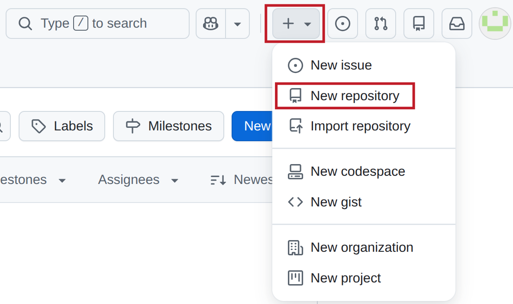{: style="height:400px;width:650px"}
  <figcaption>Click the + icon and select "New repository"</figcaption>
</figure>

3. Name your repository: `hello-github` (use lowercase)
4. Add a description: "My test GitHub repository"
5. Choose **Public** (so everyone can see it)
6. Check the box: **Add a README file**
7. Click **Create repository**

<figure markdown>
  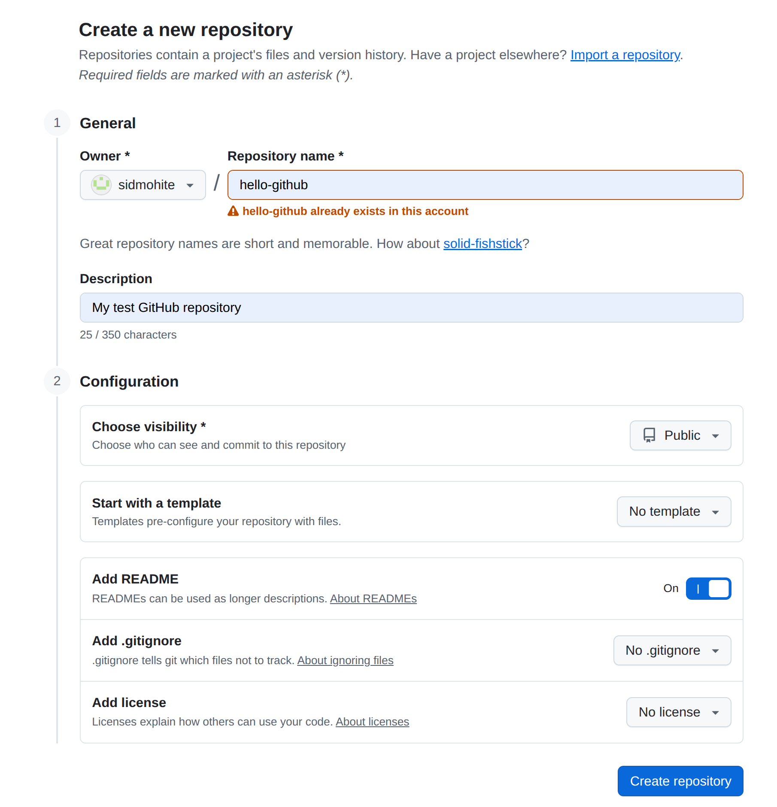{: style="height:800px;width:800px"}
  <figcaption>Fill in the repository details</figcaption>
</figure>

Congratulations! Your repository is now live at `github.com/your-username/hello-github`.

### Step 2: Clone the Repository to Your Computer

Open your terminal and run:

```bash
git clone https://github.com/your-username/hello-github.git
cd hello-github
```

<figure markdown>
  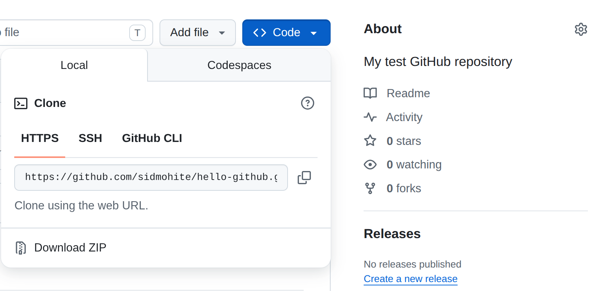{: style="height:400px;width:800px"}
  <figcaption>Click the blue "Code" button to copy the clone URL</figcaption>
</figure>

Configure Git to use SSH:
```bash
git remote set-url origin git@github.com:username/repo.git
```

Verify the repository is set up:
```bash
git remote -v  # Shows that origin points to GitHub
```

### Step 3: Make Your First Edit Locally

Create a simple Python script:

```bash
# Create a new file
cat > hello.py << 'EOF'
def greet(name):
    """A simple greeting function."""
    return f"Hello, {name}!"

if __name__ == "__main__":
    print(greet("World"))
EOF
```

### Step 4: Create a Feature Branch

Never work directly on `main`. Instead, create a branch:

```bash
git checkout -b feature/add-greeting
```

Now verify you're on the new branch:
```bash
git branch  # Shows you're on feature/add-greeting
```

### Step 5: Commit and Push Your Changes

```bash
# Stage your changes
git add hello.py

# Commit with a descriptive message
git commit -m "feat: add greeting function"

# Push to GitHub
git push -u origin feature/add-greeting
```

<figure markdown>
  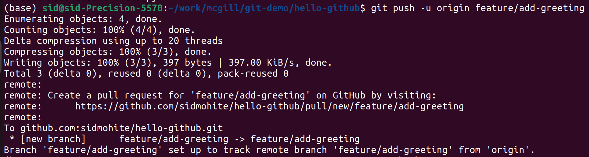{: style="height:300px;width:800px"}
  <figcaption>Git output after pushing to GitHub</figcaption>
</figure>

### Step 6: Create a Pull Request

Go to your repository on GitHub. You'll see a notification about your new branch:

<figure markdown>
  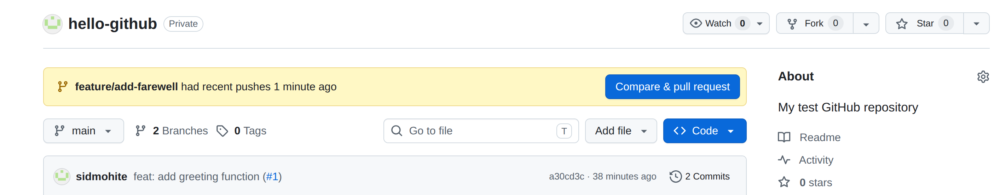{: style="height:300px;width:1050px"}
  <figcaption>GitHub prompts you to create a PR for your new branch</figcaption>
</figure>

Click **Compare & pull request**. Fill in the PR form:

- **Title**: "Add greeting function"
- **Description**: 
  ```
  This PR adds a simple greeting function.
  
  ## Changes
  - Added greet() function
  - Added example usage
  ```

<figure markdown>
  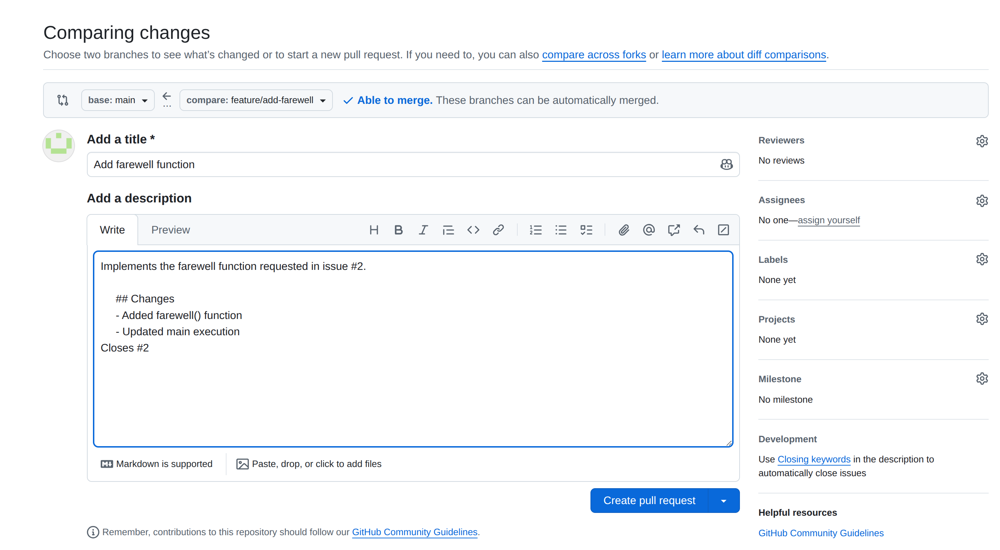{: style="height:600px;width:1000px"}
  <figcaption>Fill in your PR title and description</figcaption>
</figure>

Click **Create pull request**.

### Step 7: Review the Pull Request

Your PR page shows:

- The changes you made (blue = additions)
- A "Conversation" tab for comments
- A "Files changed" tab to review the diff

<figure markdown>
  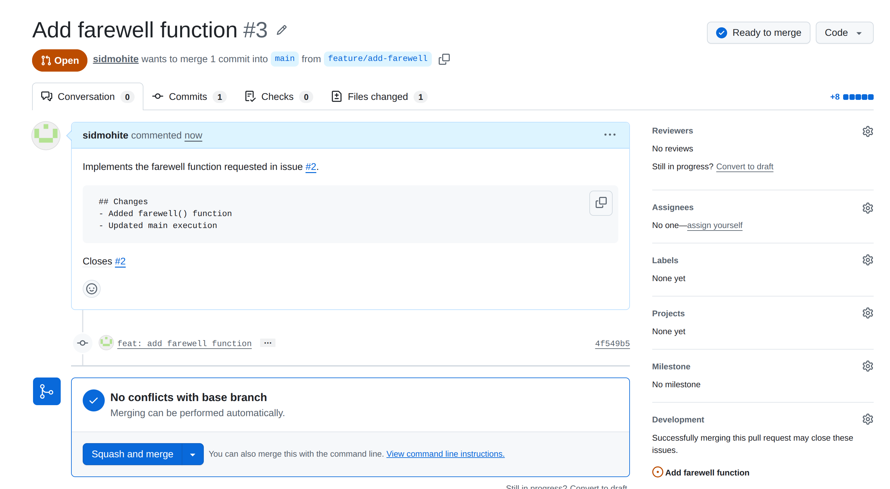{: style="height:600px;width:1000px"}
  <figcaption>Your pull request is ready for review</figcaption>
</figure>

Click on the **Files changed** tab to see exactly what you modified:

<figure markdown>
  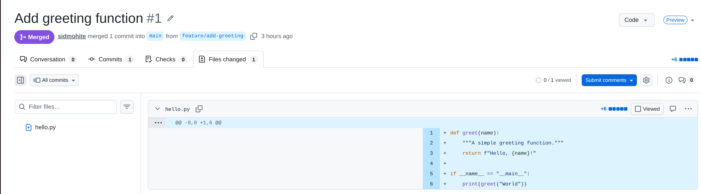{: style="height:350px;width:1000px"}
  <figcaption>Green lines show what you added</figcaption>
</figure>

### Step 8: Merge Your Pull Request

Once you're satisfied with your changes, merge the PR:

1. Click the drop-down button next to **Merge pull request**
2. Choose **Squash and merge** and click it (keeps history clean)
3. Click **Confirm squash and merge**

<figure markdown>
  {: style="height:600px;width:1000px"}
  <figcaption>Click "Merge pull request" to integrate your changes</figcaption>
</figure>

Your code is now on `main`! You can optionally delete the feature branch.

### Step 9: Update Your Local Repository

Back on your computer, switch to main and pull the changes:

```bash
git checkout main
git pull origin main
```

Verify your file is there:
```bash
ls hello.py
python hello.py  # Runs your script!
```

### Step 10: Create an Issue to Track Future Work

Issues are how teams track bugs, feature requests, and tasks. Let's create one:

1. Go to your repository on GitHub
2. Click the **Issues** tab
3. Click **New issue**

<figure markdown>
  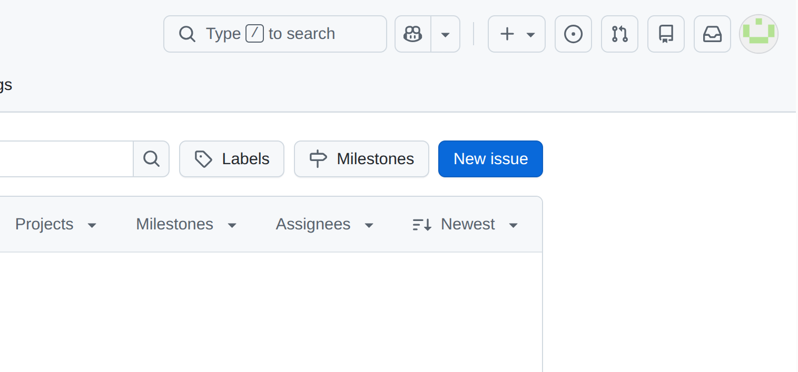{: style="height:300px;width:600px"}
  <figcaption>Click "New issue" to create a task</figcaption>
</figure>

4. Fill in the issue form:
   - **Title**: "Add farewell function"
   - **Description**:
     ```
     We should add a farewell function to complement the greeting.
     
     ## Acceptance Criteria
     - Function returns a goodbye message
     - Follows the same style as greet()
     - Include example usage
     ```
5. Click **Submit new issue**

<figure markdown>
  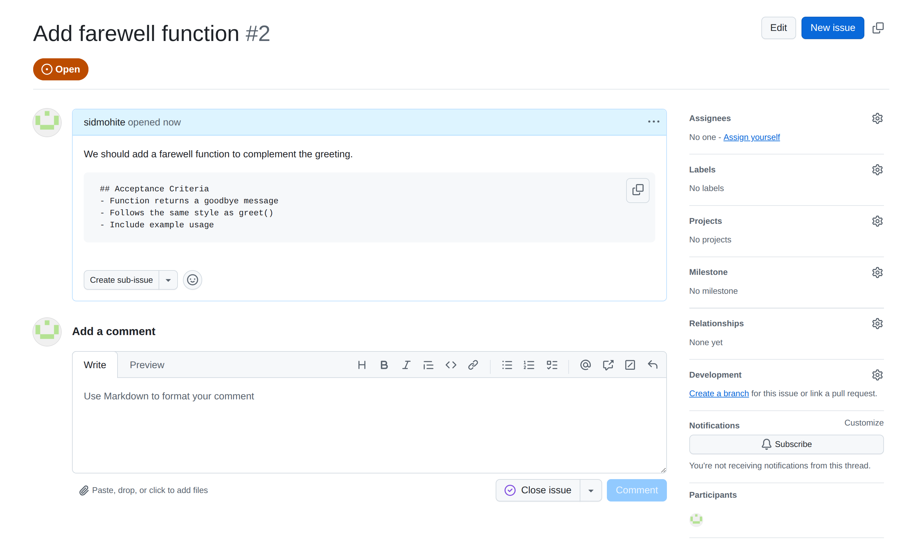{: style="height:600px;width:1000px"}
  <figcaption>Fill in the issue title and description</figcaption>
</figure>

Notice GitHub assigns your issue a number (e.g., #2). You can now reference this in commits and PRs!
**Bonus point : Do you know why the issue gets assigned #2 and not #1?**

### Step 11: Create a Feature Branch Linked to the Issue

Create a new branch for this issue:

```bash
git checkout main
git pull origin main
git checkout -b feature/add-farewell
```

Now implement the farewell function:

```bash
cat >> hello.py << 'EOF'

def farewell(name):
    """A simple farewell function."""
    return f"Goodbye, {name}!"

if __name__ == "__main__":
    print(greet("World"))
    print(farewell("World"))
EOF
```

Commit your changes **referencing the issue number**:

```bash
git add hello.py
git commit -m "feat: add farewell function

- Implement farewell() function
- Add to main execution

Closes #2"
```

The `Closes #2` keyword tells GitHub to automatically close issue #2 when this PR is merged!

Push to GitHub:

```bash
git push -u origin feature/add-farewell
```

### Step 12: Create a PR and Link It to the Issue

Go to GitHub and create a new PR:

1. Click **Compare & pull request**
2. Fill in:
   - **Title**: "Add farewell function"
   - **Description**:
     ```
     Implements the farewell function requested in issue #2.
     
     ## Changes
     - Added farewell() function
     - Updated main execution
     
     Closes #2
     ```

<figure markdown>
  {: style="height:500px;width:800px"}
  <figcaption>Reference the issue number in your PR description</figcaption>
</figure>

3. Click **Create pull request**

When you merge this PR, GitHub will automatically close issue #2!

### Step 13: Enable Branch Protection Rules

Let's set up best practices to require code review before merging to `main`:

1. Go to your repository → **Settings** tab
2. Click **Branches** in the left sidebar
3. Click **Add classic branch protection rule** under "Branch protection rules"

<figure markdown>
  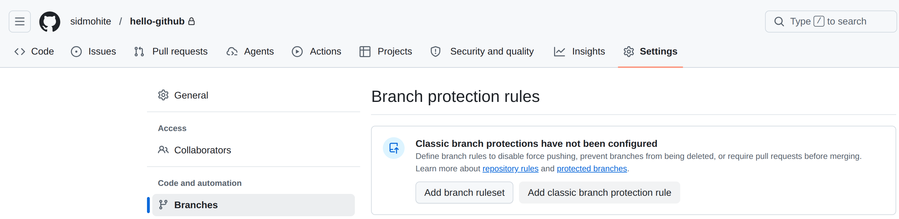{: style="height:350px;width:1000px"}
  <figcaption>Navigate to branch protection rules</figcaption>
</figure>

4. Configure the rule:
   - **Branch name pattern**: `main`
   - Check: **Require a pull request before merging**
   - Check: **Require at least 1 approval**
   - Check: **Dismiss stale pull request approvals**
   - Click **Create**

<figure markdown>
  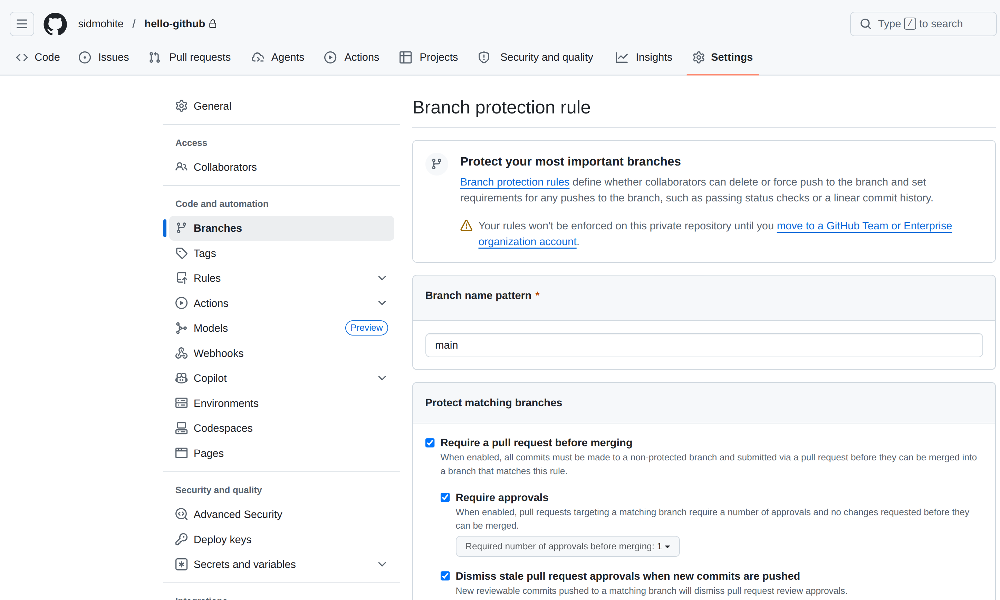{: style="height:600px;width:900px"}
  <figcaption>Select protection rules for the main branch</figcaption>
</figure>

Now, direct pushes to `main` are blocked! All code must go through a PR with review.

### Step 14: Collaboration - Forking and Contributing (Optional)

Want to contribute to someone else's project? Use fork workflow:

1. Go to the repository you want to contribute to - **https://github.com/sidmohite/hello-github-fork**
2. Click **Fork** in the top right

<figure markdown>
  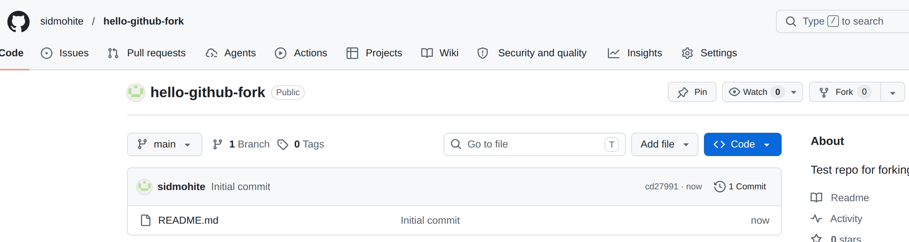{: style="height:300px;width:900px"}
  <figcaption>Fork creates a copy of the repository under your account</figcaption>
</figure>

3. Clone your fork:
Locally, change your directory to where you want to place this "forked" project and then
```bash
git clone https://github.com/your-username/hello-github-fork.git
cd hello-github-fork
```

4. Add upstream remote to track the original repo:
```bash
git remote add upstream https://github.com/sidmohite/hello-github-fork.git
git remote -v  # Verify you have both origin and upstream
```

5. Create a feature branch and make changes:
```bash
git checkout -b fix/bug-fix
# ... make changes ...
git commit -m "fix: resolve issue with feature"
git push origin fix/bug-fix
```

6. On GitHub, click **Compare & pull request** to submit PR to the original repo
7. Maintain your fork by pulling updates from upstream:
```bash
git fetch upstream
git checkout main
git merge upstream/main
git push origin main
```

---

### Step 15: Best Practices Checklist

Now that you've gone through the full workflow, here's what you should always follow:

✓ **Always use feature branches**
  ```bash
  git checkout -b feat/description or fix/description
  ```

✓ **Write clear, atomic commits**
  ```bash
  git commit -m "feat: concise description of change"
  ```

✓ **Link commits to issues**
  ```
  Closes #42  or  Fixes #1
  ```

✓ **Require code review before merging** (via branch protection)
  - Set in Settings → Branches → Add rule

✓ **Use squash and merge for feature branches** to keep history clean
  - Keep `main` history readable

✓ **Never force push to main**
  ```bash
  # Never do this on main:
  git push --force origin main  # ❌ Dangerous!
  ```

✓ **Keep PRs focused and small**
  - Easier to review
  - Easier to revert if needed
  - Fewer merge conflicts

✓ **Add meaningful PR descriptions**
  - Explain the "why", not just the "what"
  - Reference related issues
  - Include testing instructions

---

### Key Concepts from This Workflow

✓ **Branching**: Separate branches protect the main code  
✓ **Commits**: Each commit is a checkpoint with a clear message  
✓ **Issues**: Track bugs, features, and tasks  
✓ **Pull Requests**: A review gate before code reaches main  
✓ **Merging**: Integrating changes with full history  
✓ **Branch Protection**: Enforce code review requirements  
✓ **Forking**: Contribute to projects you don't own  

This workflow is the standard across industry and open source projects. Practice it repeatedly!

## Summary

You now have the knowledge to effectively use GitHub for collaboration, code review, and project management. Practice these workflows in your own repositories!

## Resources

- [GitHub Docs](https://docs.github.com)
- [GitHub Guides](https://guides.github.com)
- [Collaborating with Pull Requests](https://docs.github.com/en/pull-requests)
- [GitHub Issues Documentation](https://docs.github.com/en/issues)
- [Fork a Repository](https://docs.github.com/en/get-started/quickstart/fork-a-repo)
