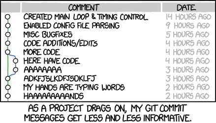
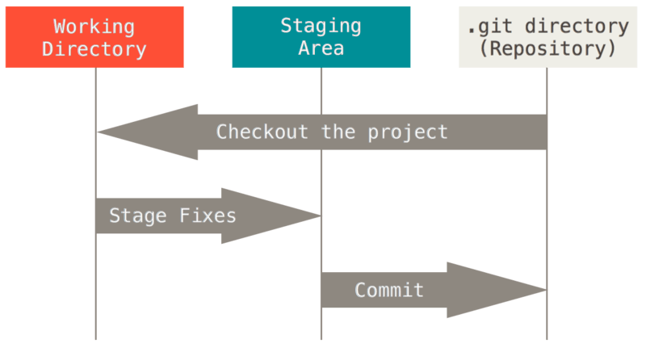
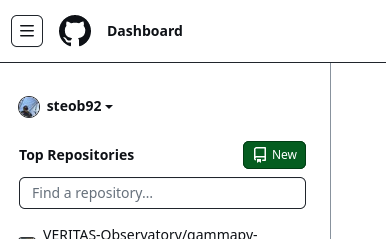
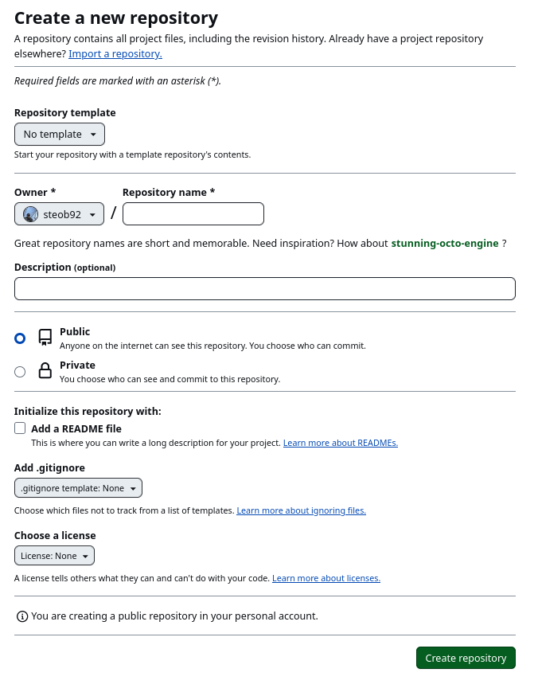
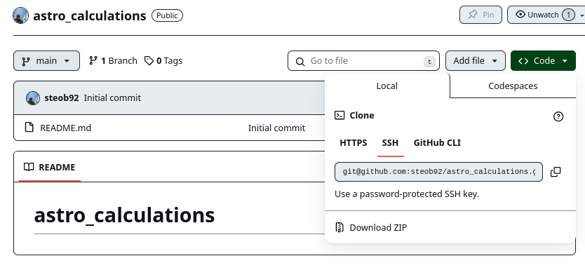
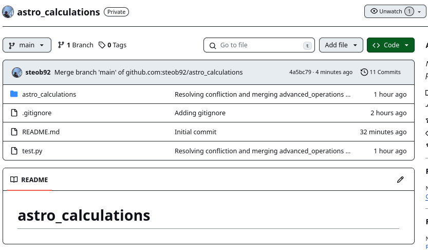

## About

In this tutorial we will, we cover the very basics of [Git](https://git-scm.com/).
Git is a "free and open source" ([FOSS](https://en.wikipedia.org/wiki/Free_and_open-source_software)) "distributed version control" system.
Let's dissect what "distributed version control" means.

### Version Control

Version control is a method to keep track of the history of a code base.
We can think of this as a list of changes between versions of files from one code version to the next.
When working with a version of a code base, we will modify individual files within the code base. 
When we are happy with the new versions of the files, we can `commit` the changes made, along with a helpful message describing the changes.

<figure markdown>
  {: style="height:300px;width:500px"}
  <figcaption>Version control (source <a href="https://xkcd.com/1296/">xkcd.com</a>) </figcaption>
</figure>

Informative commit messages help identify changes form the previous commit.
This provides useful information when trying to debug issues with the code and identifying significant changes.
Knowing the "history" of the code, we can `revert` to a previous version of the code (or a previous version of a specific file).
This can help to resolve issues in a code base.


!!! info "Aside on version numbers"
    
    For example, if version 1.0.0 had a function with an expensive run time (`my_func()`).
    ```python
    def my_func(x):
        sleep(10)
        return x[0] + x[1]
    ```

    We changed the function to reduce the run time by changing how some calculation is done, we would `commit` a message like "implemented faster calculation method for my_func". 
    ```python
    def my_func(x):
        return x[0] + x[1]
    ```
    Upon `commit`-ing we may decide to increment the version number to 1.1.0.
    Here we changed the second digit.
    This specifices that there has been a minor change to the code.
    
    After some testing of the code, we now know that the new method introduced an error in the calculation, luckily there is a quick fix.
    ```python
    def my_func(x):
        return np.sqrt(x[0]**2 + x[1]**2)
    ```
    Implementing this fix we may `commit` the modifed code with a message "resolved bug introduced in v1.1.0 for my_func".
    With this bug resolved, we now decide to increment the versiion number to 1.1.1. 
    Here we changed the final digit, this tells the user that going from 1.1.0 to 1.1.1 is a bug fix.

    After some redesign of our code, we then decide that the `my_func` function needs a more informative name.
    So we change the name from `my_func` to `calculate_distance`, and `commit` the changes with the message "changing my_func name to calculate_distance to improve readabiltiy".
    ```python
    def calculate_distance(x):
        return np.sqrt(x[0]**2 + x[1]**2)
    ```

    Changing the function name would be "API breaking" meaning that code relying on version 1.1.1 will no longer work on the current version. For this reason we would call the version 2.0.0. Here incrementing the first digit tells the user that it is nolonger compatable with version 1.x.y.
    ```python
    ...

    values = [6.28, 3.14]
    # Workds with v1.* but not v2.*
    distance = my_func(values)
    # Workds with v2.* but not with v1.*
    distance = calculate_distance(values)
    

    ```

    

    This is known as [Semantic Versioning](https://semver.org/).
    Under this convention versions are named using 3 digits (version a.b.c):
    * a: Major version number (when the API changes)
    * b: Minor version number (when functionality changes in a backwards compatable way)
    * c: Patch version number (when bug fixes are added in a backwards compatiable way)

    It's also common to see x.y.z.-alpha, x.y.z-beta or x.y.z-rc. Here the developers have frozen development for the future x.y.z release, with any further major/minor changes to be included in a future version.
    alpha/beta refer to testing versions with an alpha typically an initial test version open to a small set of interal collaborators, beta refering to a more open or second round of testing which is open to the public. 
    rc would refer to a "release candidate". 
    A rc version would be used for final tests of the full x.y.z version before making it available.
    The differences between x.y.z-rc and x.y.z would only reflect bug fixes found during final testing of the x.y.z-rc branch.

    See [this post](https://safjan.com/software-versioning-schemes/) for a discussion of different versioning schemes.


### Distributed Version Control

Distributed version control allows for the entire codebase to be mirrored on every developer's machine, rather than a single location.
This prevents the codebase from being destroyed either due to a disk failure or by local changes.
With distributed version control, multiple developers can work on a single code base without conflicting with other developers' work.
Git allows for remote developers to change code and `commit` the code to remote `repository` (e.g. [GitHub](www.github.com)), by `push`-ing their changes. 

Git allows for `branch`-es.
These are parallel instances of the codebase, which allow for independent development without interfering with other branches. 

<figure markdown>
  {: style="height:300px;width:500px"}
  <figcaption>Branching (source <a href="https://www.nobledesktop.com/learn/git/git-branches">nobledesktop.com</a>) </figcaption>
</figure>

It is common practice to maintain a `main` or `master` branch. 
This branch reflects the most up to date, yet stable, version of the code.
When someone wants to develop a new feature, they will `branch` out from the `main` branch to create what might be referred to as a "feature" branch.
With this branch the developer will make the required changes and run tests.
Once they're happy with the changes, they will then `merge` their code into the `main` branch. 
It is common for integration tests to be passed before allowing anything to be merged into the main branch.


## Using Git

Let create a small project to illustrate how to use git.

```
» tree                    [11:05:58]
.
├── astro_calculations
│   ├── __init__.py
│   └── math_operations.py
└── test.py
```

Here we have a simple python package called `astro_calculations`. The folder `astro_calculations` includes two files `math_operations.py`, which defines the functions:

```python title="math_operations.py" linenums="1"
def add(a, b):
    return a + b

def sub(a,b):
    return a - b

def mult(a,b):
    return a * b

def div(a,b):
    return a / b    
```

and `__init__.py` which imports the functions and specifies the `__all__` list:
```python title="__init__.py" linenums="1"
from .math_operations import add, sub, mult, div

__all__ = ["add", "sub", "mult", "div"]
```

`__all__` is a special variable in python which defines a list of what is imported when running `from package import *`.

We also have a `test.py` file:
```python title="test.py" linenums="1"
from astro_calculations import *

x = 1
y = 2

# Running some test
assert(add(x,y) == 3)
assert(sub(x,y) == -1)
assert(mult(x,y) == 2)
assert(div(x,y) == 0.5)
```

This defines a set of tests we can use to ensure the correct behavior of the code.


### Creating a new repository

We can create a new repository for the existing `astro_calculation` codebase by running:
```bash
git init
```

From within the project directory. This provides the following output:
```
git init                [11:13:43]
hint: Using 'master' as the name for the initial branch. This default branch name
hint: is subject to change. To configure the initial branch name to use in all
hint: of your new repositories, which will suppress this warning, call:
hint: 
hint: 	git config --global init.defaultBranch <name>
hint: 
hint: Names commonly chosen instead of 'master' are 'main', 'trunk' and
hint: 'development'. The just-created branch can be renamed via this command:
hint: 
hint: 	git branch -m <name>
Initialized empty Git repository in /raid/RAID1/Tutorials/git-tutorial/.git/
```

This also creates a `.git` folder within the directory.
The `.git` folder is the "repository". 
This folder contains history of the codebase, by tracking changes made to files. 
If one deletes the `.git` folder, one deletes the history of the codebase (or at least the local copy of it). 
With access to the `.git` folder, a developer can see what has been changed across the entire history of the code, revert to previous versions of the code, check out `tagged` versions of the code, swap to a different `branch` of the code and access many other features.
For now, we'll ignore the `.git` folder and its contents.

### The staging area

Git uses a "staging area" to prepare changes to the codebase to be committed. 


<figure markdown>
  {: style="height:300px;width:500px"}
  <figcaption>Staging Area (source <a href="https://git-scm.com/book/en/v2/Getting-Started-What-is-Git%3F">git-scm.com</a>) </figcaption>
</figure>

After files are modified, we can specify which files are set to be committed by adding them to the staging area. 
Once we are happy with the files to be committed, we can then commit these changes to the repository (the `.git` folder).

We can see the current status of the repo using:
```bash
git status
```
For the `astro_calculations` example, this yields:
```linenums="1"
On branch master

No commits yet

Untracked files:
  (use "git add <file>..." to include in what will be committed)
	astro_calculations/
	test.py

nothing added to commit but untracked files present (use "git add" to track)
```
On line 1 the current branch is specified as `master`. 
On line 3 it says that we have no commits
On lines 5-8 we have a list of untracked files. 
Untracked files are files which are not being tracked by the fit repo.

From the above, we see that we can use `git add <file>` to add a file or change to a file, to be committed. 
We can add all files that have been checked to the commit using `git add .` . 
We can add `astro_calculations` folder and `test.py` file to the "staging area" with:
```bash
git add test.py astro_calculations/
```

Rerunning `git status` we get:
```linenums="1" hl_lines="7-9"
On branch master

No commits yet

Changes to be committed:
  (use "git rm --cached <file>..." to unstage)
	new file:   astro_calculations/__init__.py
	new file:   astro_calculations/math_operations.py
	new file:   test.py
```
On lines 7-9 we now see that we have new files staged to be committed.
This is to say that `astro_calculations/__init__.py`, `astro_calculations/math_operations.py` and `test.py` have been added to the staging area.
The changes to these files haven't yet been committed to the repo.
To commit changes we use:
```bash
git commit -m "message"
```
Where "message" is the commit message, an informative description of what has been committed. 
Since we are adding some initial code to the repo, we might write a commit message like:
```bash
git commit -m "Adding initial code to the repo"
```
Which gives the following output:
```
[master (root-commit) 38e2d00] Adding initial code to the repo
 3 files changed, 24 insertions(+)
 create mode 100644 astro_calculations/__init__.py
 create mode 100644 astro_calculations/math_operations.py
 create mode 100644 test.py
```
Here we see that 3 files have been changed, with each file having a `create mode`. 
This tells the repo that new files have been "created".

Let's make a change to `astro_calculations/math_operations.py` to include a modulo function:
```python title="math_operations.py" linenums="13"
def modulo(a,b):
    return a % b
```

Running `git status` we can see that changes to the file have been detected:
```
On branch master
Changes not staged for commit:
  (use "git add <file>..." to update what will be committed)
  (use "git restore <file>..." to discard changes in working directory)
	modified:   astro_calculations/math_operations.py

no changes added to commit (use "git add" and/or "git commit -a")
```
We can see that `astro_calculations/math_operations.py` have been modified, but not yet added to the staging area. 

### Difference between commits `git diff`
Let's use `git diff` to see what has been changed in `astro_calculations/math_operations.py`.
```
git diff astro_calculations/math_operations.py
```

```bash
diff --git a/astro_calculations/math_operations.py b/astro_calculations/math_operations.py
index fcfdc03..75e7956 100644
--- a/astro_calculations/math_operations.py
+++ b/astro_calculations/math_operations.py
@@ -9,3 +9,6 @@ def mult(a,b):
 
 def div(a,b):
     return a / b
+
+def modulo(a,b):
+    return a % b
```

This shows the `diff` between the current version of the file and the version last committed to the repo.
We can add the file to the staging area: 
```
git add astro_calculations/math_operations.py
```

And rerun `git status` to see:
```
On branch master
Changes to be committed:
  (use "git restore --staged <file>..." to unstage)
	modified:   astro_calculations/math_operations.py
```

We can commit the change with a useful message:
```
git commit -m "Adding modulo function"
```

## Understanding Histories of files (`git log`)

Git stores the history of a file by tracking the lines that have changed from one commit to the next, rather than storing multiple copies of the same file.
In terms of storage, this provides a light-weight method to store long histories.
We can inspect the history of files and repos using the `git log` command.
Running `git log` will show the previous commits of the repo, for example:

```linenums="1" hl_lines="1 2 3 5"
commit 4bbbf9e19f3d4f6d067ca04258e2f72e342c8e42 (HEAD -> master)
Author: Ste O Brien <stephan.obrien@mcgill.ca>
Date:   Fri Jan 26 12:05:25 2024 -0500

    Adding modulo function

commit 38e2d008831daaaeadcf6466dbe1a375f6cfbc1b
Author: Ste O Brien <stephan.obrien@mcgill.ca>
Date:   Fri Jan 26 11:50:29 2024 -0500

    Adding initial code to the repo
```

On line 1 we can see the id for the most recent commit, on line 2 we see the author of that commit, with the date of line 3. 
On line 5 we see the commit message. 
In the above example we only have two commits. 
Let's add a new file:
```python title="astro_calculations/printing.py" linenums="1" 
def print_details(a, b):
    print(f"Calling with arguments {a} and {b} ")
```
We'll also add this to be imported into when we run `from astro_calculations import *`:
```python title="astro_calculations/__init__.py" linenums="1"   hl_lines="2,3"
from .math_operations import add, sub, mult, div
from .printing import print_details
__all__ = ["add", "sub", "mult", "div", "print_details"]
```

Add these to the staging area :
```bash
git add astro_calculations/__init__.py astro_calculations/printing.py 
```

```bash
$ git status
On branch master
Changes to be committed:
  (use "git restore --staged <file>..." to unstage)
	modified:   astro_calculations/__init__.py
	new file:   astro_calculations/printing.py
```


```bash
git commit -m "Adding printing function"
[master d38bd2d] Adding printing function
 2 files changed, 4 insertions(+), 2 deletions(-)
 create mode 100644 astro_calculations/printing.py
```

This says that we have modified two files, one of which was newly created. 
Note that it records "insertions" and "deletions" to the files.

Running `git log` we can see our new commit:
```
commit d38bd2de7b4be9b7ccc843889d1894da96e68a00 (HEAD -> master)
Author: Ste O Brien <stephan.obrien@mcgill.ca>
Date:   Fri Jan 26 13:12:47 2024 -0500

    Adding printing function

commit 4bbbf9e19f3d4f6d067ca04258e2f72e342c8e42
Author: Ste O Brien <stephan.obrien@mcgill.ca>
Date:   Fri Jan 26 12:05:25 2024 -0500

    Adding modulo function

commit 38e2d008831daaaeadcf6466dbe1a375f6cfbc1b
Author: Ste O Brien <stephan.obrien@mcgill.ca>
Date:   Fri Jan 26 11:50:29 2024 -0500

    Adding initial code to the repo
```

We can also check the log of an individual file using:
```
git log astro_calculations/math_operations.py
```

```
commit 4bbbf9e19f3d4f6d067ca04258e2f72e342c8e42
Author: Ste O Brien <stephan.obrien@mcgill.ca>
Date:   Fri Jan 26 12:05:25 2024 -0500

    Adding modulo function

commit 38e2d008831daaaeadcf6466dbe1a375f6cfbc1b
Author: Ste O Brien <stephan.obrien@mcgill.ca>
Date:   Fri Jan 26 11:50:29 2024 -0500

    Adding initial code to the repo
(END)
```

Recall we've only changed `astro_calculations/math_operations.py` once since the initial commit.
The most recent commit, where we added the printing function, isn't included in this file's history. 
Since the file hasn't changed, there is no need to record any difference to the file.

If we want to see a more detailed log, we can pass a `-p` flag to `git log`:
```bash
git log -p astro_calculations/math_operations.py
```
This gives a more detailed description of the changes:
```bash
commit 4bbbf9e19f3d4f6d067ca04258e2f72e342c8e42
Author: Ste O Brien <stephan.obrien@mcgill.ca>
Date:   Fri Jan 26 12:05:25 2024 -0500

    Adding modulo function

diff --git a/astro_calculations/math_operations.py b/astro_calculations/math_operations.py
index fcfdc03..259f48e 100644
--- a/astro_calculations/math_operations.py
+++ b/astro_calculations/math_operations.py
@@ -9,3 +9,6 @@ def mult(a,b):
 
 def div(a,b):
     return a / b
+
+def modulo(a,b):
+    return a % b

commit 38e2d008831daaaeadcf6466dbe1a375f6cfbc1b
Author: Ste O Brien <stephan.obrien@mcgill.ca>
Date:   Fri Jan 26 11:50:29 2024 -0500

    Adding initial code to the repo

diff --git a/astro_calculations/math_operations.py b/astro_calculations/math_operations.py
new file mode 100644
index 0000000..fcfdc03
--- /dev/null
+++ b/astro_calculations/math_operations.py
@@ -0,0 +1,11 @@
+def add(a, b):
+    return a + b
+
+def sub(a,b):
+    return a - b
+
+def mult(a,b):
+    return a * b
+
+def div(a,b):
+    return a / b
```
This highlights the actual changes between commits.


## Viewing different version of the code

We can use the `git checkout` command to view different version of the code. 
This is a versatile command, for the moment let's use it to view a previous version of the codebase.
Use `git log` to view the previous commits:
```
commit d38bd2de7b4be9b7ccc843889d1894da96e68a00 (HEAD -> master)
Author: Ste O'Brien <stephan.obrien@mcgill.ca>
Date:   Fri Jan 26 13:12:47 2024 -0500

    Adding printing function

commit 4bbbf9e19f3d4f6d067ca04258e2f72e342c8e42
Author: Ste O'Brien <stephan.obrien@mcgill.ca>
Date:   Fri Jan 26 12:05:25 2024 -0500

    Adding modulo function

commit 38e2d008831daaaeadcf6466dbe1a375f6cfbc1b
Author: Ste O'Brien <stephan.obrien@mcgill.ca>
Date:   Fri Jan 26 11:50:29 2024 -0500

    Adding initial code to the repo

```

Lets checkout the version of the code prior to adding the printing function `4bbbf9e19f3d4f6d067ca04258e2f72e342c8e42`:
```bash
git checkout 4bbbf9e19f3d4f6d067ca04258e2f72e342c8e42
```

```
Note: switching to '4bbbf9e19f3d4f6d067ca04258e2f72e342c8e42'.

You are in 'detached HEAD' state. You can look around, make experimental
changes and commit them, and you can discard any commits you make in this
state without impacting any branches by switching back to a branch.

If you want to create a new branch to retain commits you create, you may
do so (now or later) by using -c with the switch command. Example:

  git switch -c <new-branch-name>

Or undo this operation with:

  git switch -

Turn off this advice by setting config variable advice.detachedHead to false

HEAD is now at 4bbbf9e Adding modulo function
```

We can see that `astro_calculations/printing.py` is no longer in our directory:
```
tree                                                                                                                       [13:47:40]
.
├── astro_calculations
│   ├── __init__.py
│   └── math_operations.py
└── test.py
```


We can switch back to the main branch using `git switch -`:
```
git switch -
```

```
Previous HEAD position was 4bbbf9e Adding modulo function
Switched to branch 'master'
```

### Reverting individual files

Let's say we've made some changes to a file and prematurely committed the file.  We might see something like this:
```
On branch master
Changes to be committed:
  (use "git restore --staged <file>..." to unstage)
	modified:   astro_calculations/math_operations.py

```

We can remove the file from the staging area using:
```
git restore --staged astro_calculations/math_operations.py
```

This file is now marked as modified but not staged:
```
On branch master
Changes not staged for commit:
  (use "git add <file>..." to update what will be committed)
  (use "git restore <file>..." to discard changes in working directory)
	modified:   astro_calculations/math_operations.py

```

We note that the file is still modified. If we wanted to undo these changes and revert to the current version in the `master` branch we could run:
```
git checkout master -- astro_calculations/math_operations.py
```
We will now see the `master` branch version of `astro_calculations/math_operations.py`. 

Let's say we now know that there was a bug introduced in one of the previous commits. We can access the previous version of the file, prior to that commit by first looking at the log of the file:
```
git log -p astro_calculations/math_operations.py
``` 
For me the initial commit is `38e2d008831daaaeadcf6466dbe1a375f6cfbc1b`. To revert the file back to this commit:
```
git checkout 38e2d008831daaaeadcf6466dbe1a375f6cfbc1b -- astro_calculations/math_operations.py
``` 

We will now see the original version of the file, and the file will be listed as `modified` when running `git status`. We can commit this as we would any other change to the code `git add astro_calculations/math_operations.py`.


## Gitignore

You might have noticed that if you've tried to run the python code then a `astro_calculations/__pycache__/` directory was created.
Running `git status` you might see:
```
Untracked files:
  (use "git add <file>..." to include in what will be committed)
	astro_calculations/__pycache__/

```

This directory contains the precompiled python code.
When we create a python module, it can be precompiled rather than compiled at run time. 
This helps to improve the performance of the code.

We don't want this precompiled byte code to be committed or tracked. 
We can exclude files using a `.gitignore` file. 
A file which starts with a `.` will typically be hidden from file browsers and `ls`. 
Git will look for the `.gitignore` file to define what files should be excluded when monitoring the codebase.

Create a file in the root directory of the repository and add the following lines:
```title=".gitignore"
# Byte-compiled / optimized / DLL files
__pycache__/
*.py[cod]
```

This will exclude any directory with the name `__pycache__` and any files ending in `.pyc`, `.pyo` or `.pyd`. 
These are suffices created when compiling python code.
If we rerun `git status` we see:
```
Untracked files:
  (use "git add <file>..." to include in what will be committed)
	.gitignore

nothing added to commit but untracked files present (use "git add" to track)
``` 
Git sees the `.gitignore` file and knows to exclude the `astro_calculations/__pycache__/` directory because it has the `__pycache__` pattern.
We should add and commit the `.gitignore` file. 
As the project gets more complicated we might want to add additional patterns to this file.
Standard `.gitignore` files can be found [here](https://github.com/github/gitignore/tree/main).

## Branching

Git uses `branch`-es to allow the codebase to be modified without affecting the current state of the `branch`.
When branching we take an instance of one `branch` of the code (for example the `master` or `main` branch), and spawn a copy of that `branch` that where we will develop the code further.
This is particularly useful when developing and testing new features of the code base without disrupting the codebase for other users.


### Renaming branches
We'll start off by using the `branch` command to rename the `master` branch.
First make sure we're on the `master` branch.
```
git checkout master
```

Now rename the branch using:
```
git branch -M main
```
`git status` should now show that we are on the `main` branch:
```
On branch main
...
```
[It is good practice to adopt inclusive language standards when programming. ](https://developers.google.com/style/inclusive-documentation)

### Creating new branches

We can create a new branch from the current branch we are on using:
```
git checkout -b documentation                                                                                                  [9:34:01]
```
```
Switched to a new branch 'documentation'
```

Here we have used `checkout` with the `-b` flag to create a new branch called `documentation`. 
Under the hood the `-b` flag tells git to create a new branch called `documentation` and then immediately switch to that branch.
We can use `git branch` to see the current branched and `git branch new-branch` to create a new branch called `new-branch`, without switching to that branch.
 
We can change between branches using `git checkout <branch_name>`.
For example `git checkout main` will put us back on the `main` branch.

From the `documentation` branch lets add some [doc strings](https://google.github.io/styleguide/pyguide.html) to help document our code:
```python title="astro_calculations/math_operations.py" linenums="1"
def add(a, b):
    """Adds two values together.

    Args:
      a: input value float or int
      b: input value float or int

    Returns:
      a + b
    
    Examples:
        Two values can be added like:

        >>> add(1,2)
        3
    """
    return a + b

def sub(a,b):
    """Subtracts one value from another.

    Args:
      a: input value float or int
      b: input value float or int

    Returns:
      a - b
    
    Examples:
        Two values can be subtracted like:

        >>> sub(1,2)
        -1
    """
    return a - b

def mult(a,b):
    """Multiplies two values together.

    Args:
      a: input value float or int
      b: input value float or int

    Returns:
      a * b
    
    Examples:
        Two values can be multiplied like:

        >>> mult(1,2)
        2
    """
    return a * b

def div(a,b):
    """Divides one value by another.

    Args:
      a: input value float or int
      b: input value float or int

    Returns:
      a / b
    
    Examples:
        Two values can be divided like:

        >>> div(1,2)
        0.5
    """
    return a / b

```

And commit this to the `documentation` branch. 
This can be merged into the `main` branch using the following:
```
# Change into the main branch
git checkout main
```

Use `git merge` to merge the `documentation` branch into the `main` branch. 
```
git merge documentation
```

```
Updating e4ea138..b1ce3e9
Fast-forward
 astro_calculations/math_operations.py | 60 ++++++++++++++++++++++++++++++++++++++++++++++++++++++++++++
 astro_calculations/printing.py        | 10 ++++++++++
 2 files changed, 70 insertions(+)
```

The documentation branch can then be deleted using:
```
git branch -d documentation
```
```
Deleted branch documentation (was b1ce3e9).
```

### Resolving a Confliction

Let's create two new branches from the current `main` branch. 
```
git checkout -b improve_tests
```
In the `improve_tests` branch we will improve the testing program `test.py`.
```python title="test.py" linenums="1"
import numpy as np
from astro_calculations import *

x = 1
y = 2

# Testing all values between 0 and 99
for i in range(100):
    assert(add(i,x) == i + 1)
    assert(sub(i,x) == i - 1)
    assert(mult(i,y) == i * y)
    assert(div(i,y) == i / y)

x_arr = np.array([1,2,3,4])
y_arr = np.array([1,2,3,4])

# Testing numpy arrays
assert(np.all(add(x_arr, y_arr) == (x_arr + y_arr)))
assert(np.all(sub(x_arr, y_arr) == x_arr - y_arr))
assert(np.all(mult(x_arr, y_arr) == x_arr * y_arr))
assert(np.all(div(x_arr, y_arr) == x_arr / y_arr))

```
Add and commit these changes to the `improve_tests` branch.

Create another new branch from the `main` branch. We can specify a branch to branch from like so:
```
git checkout -b advanced_operations main
``` 

In the `advanced_operations` branch lets add a `sqrt` function to the `math_operations.py` file:
```python title="astro_calculations/math_operations.py" linenums="74"
...

def sqrt(a):
    """Returns the square root if real, or 0 if complex.

    Args:
      a: input value float or int

    Returns:
      np.sqrt(a)
    
    Examples:
        Two values can be divided like:

        >>> sqrt(4)
        2
    """
    if a >= 0:
        return np.sqrt(a)
    else:
        return 0

```

Add this function to the `__init__.py` file:
```python title="astro_calculations/math_operations.py" linenums="1"
from .math_operations import add, sub, mult, div, sqrt
from .printing import print_details
__all__ = ["add", "sub", "mult", "div", "sqrt", "print_details"]
```

Let's also add a test case to the `test.py` file:
```python title="test.py" linenums="1" hl_lines="11"
from astro_calculations import *

x = 1
y = 2

# Running some test
assert(add(x,y) == 3)
assert(sub(x,y) == -1)
assert(mult(x,y) == 2)
assert(div(x,y) == 0.5)
assert(sqrt(4) == 2)

```

So we currently have 3 branches.
* `main` a branch one commit behind both of the feature branches
* `improve_tests` branch which has modified `test.py`
* `advanced_operations` branch which has modified `test.py`, `astro_calculations/math_operations.py` and `astro_calculations/__init__.py`

We can start merging branches together using `git merge`. First lets merge `improve_tests` into main.
```
$ git checkout main
$ git merge improve_tests                                                                                                         [10:57:48]
Updating b1ce3e9..c28271c
Fast-forward
 test.py | 21 ++++++++++++++++-----
 1 file changed, 16 insertions(+), 5 deletions(-)

```

This merged without any issues. Now lets merge in `advanced_operations`:
```
$ git merge advanced_operations                                                                                                   [10:57:55]
Auto-merging test.py
CONFLICT (content): Merge conflict in test.py
Automatic merge failed; fix conflicts and then commit the result.
```

This detects a confliction in the `test.py`. If we look contents of `test.py` we will see something like the following:
```python title="test.py" linenums="1" hl_lines="7 23 30"
import numpy as np
from astro_calculations import *

x = 1
y = 2

<<<<<<< HEAD
# Testing all values between 0 and 99
for i in range(100):
    assert(add(i,x) == i + 1)
    assert(sub(i,x) == i - 1)
    assert(mult(i,y) == i * y)
    assert(div(i,y) == i / y)

x_arr = np.array([1,2,3,4])
y_arr = np.array([1,2,3,4])

# Testing numpy arrays
assert(np.all(add(x_arr, y_arr) == (x_arr + y_arr)))
assert(np.all(sub(x_arr, y_arr) == x_arr - y_arr))
assert(np.all(mult(x_arr, y_arr) == x_arr * y_arr))
assert(np.all(div(x_arr, y_arr) == x_arr / y_arr))
=======
# Running some test
assert(add(x,y) == 3)
assert(sub(x,y) == -1)
assert(mult(x,y) == 2)
assert(div(x,y) == 0.5)
assert(sqrt(4) == 2)
>>>>>>> advanced_operations
```
Here we can see that the file has been modified to include all changes. 
The file also lets us know what sections of the code are conflicting and which branch they have been modified from.
Everything between `<<<<<<< HEAD` and `=======` (lines 7 and 23) exist in our current branch while everything between `=======` and `>>>>>>> advanced_operations` (lines 23 and 30) is the requested change from the `advanced_operations` branch.
We can see that the new changes would undo the changes from the `improve_tests` branch. 
We can directly modify this file to resolve the confliction:
```python title="test.py" linenums="1" hl_lines="13 23"
import numpy as np
from astro_calculations import *

x = 1
y = 2

# Testing all values between 0 and 99
for i in range(100):
    assert(add(i,x) == i + 1)
    assert(sub(i,x) == i - 1)
    assert(mult(i,y) == i * y)
    assert(div(i,y) == i / y)
    assert(sqrt(i) == np.sqrt(i))

x_arr = np.array([1,2,3,4])
y_arr = np.array([1,2,3,4])

# Testing numpy arrays
assert(np.all(add(x_arr, y_arr) == (x_arr + y_arr)))
assert(np.all(sub(x_arr, y_arr) == x_arr - y_arr))
assert(np.all(mult(x_arr, y_arr) == x_arr * y_arr))
assert(np.all(div(x_arr, y_arr) == x_arr / y_arr))
assert(np.all(sqrt(x_arr) == [np.sqrt(x) if x >= 0 else 0 for x in x_arr]))

```

Here we note that we now have a `sqrt` function to test. This is done on lines 13 and 23.
If you try this test, it will fail because `sqrt` isn't equipped to handle `numpy.array`. 
We change this using the `np.vectorize` function.
```python title="astro_calculations.py" linenums="75" hl_lines="76 96"
...
def _sqrt(a):
    """Returns the square root if real, or 0 if complex.

    Args:
      a: input value float or int

    Returns:
      np.sqrt(a)
    
    Examples:
        Two values can be divided like:

        >>> sqrt(4)
        2
    """
    if a >= 0:
        return np.sqrt(a)
    else:
        return 0
    
sqrt = np.vectorize(_sqrt)

``` 
Here we've renamed the `sqrt` function to be `_sqrt` and created a new function `sqrt = np.vectorize(_sqrt)`. 
The `sqrt` function will now call the vectorized `_sqrt` function, allowing us to pass a `numpy.array`.


## Tagging

We can `tag` a specific version of the code. 
This can be used to signal to users specific versions of the code for use.
For example, a user may want to use a stable version of the code, rather than using the `main` branch which may have feature breaking changes in the future.
We can tag a version using:
```
git tag -a v0.1.0 -m "First Release"
```
Here we are adopting the [Semantic Versioning](https://semver.org/) convention. We can see existing tags with:
```
git tag
```

We can always delete a tag using:
```
git tag -d <tag-name>
```

## Pushing to a remote repository

Git allows for remote repositories. 
This allows to maintain a hosted copy of the repository, which better protects against loss due to a computer crash.
There are many free and for profit hosting services such as [GitHub](https://www.github.com), [GitLab](https://www.gitlab.com) and [BitBucket](https://bitbucket.org). 
You can also [host your own remote repository](https://www.inmotionhosting.com/support/website/git/setting-up-your-remote-repository-with-git/).
Here we'll use GitHub, since GitHub offers free premium accounts for educations institutes (instructions for [students](https://docs.github.com/en/education/explore-the-benefits-of-teaching-and-learning-with-github-education/github-global-campus-for-students/apply-to-github-global-campus-as-a-student), instructions for ["teachers"](https://docs.github.com/en/education/explore-the-benefits-of-teaching-and-learning-with-github-education/github-global-campus-for-teachers)).


<figure markdown>
  
  <figcaption> Creating a new repository </figcaption>
</figure>


<figure markdown>
  
  <figcaption> Setup new repo </figcaption>
</figure>


From the newly created repo we can get the url by clicking on the green `code` button to the top right of the page. 
<figure markdown>
  
  <figcaption> Get the remote origin url </figcaption>
</figure>
With the new repo created we can add the remote origin for our repo:
```
git remote add origin git@github.com:steob92/astro_calculations.git 
```
If we have initialized the repo with a `README.md` or  `.gitignore` file we might want to `pull` the remote changes into our local repo.
First let's set the remote origin:
```
git branch --set-upstream-to=origin/main main 
```
Next we can try to `git pull`:
```
 git pull                                                                                                                        [12:01:38]
hint: You have divergent branches and need to specify how to reconcile them.
hint: You can do so by running one of the following commands sometime before
hint: your next pull:
hint: 
hint:   git config pull.rebase false  # merge (the default strategy)
hint:   git config pull.rebase true   # rebase
hint:   git config pull.ff only       # fast-forward only
hint: 
hint: You can replace "git config" with "git config --global" to set a default
hint: preference for all repositories. You can also pass --rebase, --no-rebase,
hint: or --ff-only on the command line to override the configured default per
hint: invocation.
fatal: Need to specify how to reconcile divergent branches.

```

We have a divergent branch since the remote main has a `README.md` file. 
We can follow the default strategy:
```
git config pull.rebase false
```

And then `pull`
```
git pull --allow-unrelated-histories    
```

The `--allow-unrealted-histories` resolves an issue with `README.md` not having a history in our local repo:
```
Merge made by the 'ort' strategy.
 README.md | 1 +
 1 file changed, 1 insertion(+)
 create mode 100644 README.md
```

We can then `push` our local changes to the remote repo:
```
git push
```
```
Enumerating objects: 43, done.
Counting objects: 100% (43/43), done.
Delta compression using up to 16 threads
Compressing objects: 100% (42/42), done.
Writing objects: 100% (42/42), 4.89 KiB | 2.45 MiB/s, done.
Total 42 (delta 9), reused 0 (delta 0), pack-reused 0
remote: Resolving deltas: 100% (9/9), done.
To github.com:steob92/astro_calculations.git
   78f86d6..4a5bc79  main -> main
```

<figure markdown>
  
  <figcaption> Uploaded changes to GitHub </figcaption>
</figure>

We can see the GitHub repo has been changed.

We can also push our tag to GitHub with:
```
$ git push origin v0.1.0

Enumerating objects: 1, done.
Counting objects: 100% (1/1), done.
Writing objects: 100% (1/1), 172 bytes | 172.00 KiB/s, done.
Total 1 (delta 0), reused 0 (delta 0), pack-reused 0
To github.com:steob92/astro_calculations.git
 * [new tag]         v0.1.0 -> v0.1.0
```
This tag will appear on the GitHub page under "Releases".

We can use the editor on github to directly edit the `README.md` file.

Once edited we can `pull` the changes to our local copy using:
```
git pull
```
```
remote: Enumerating objects: 5, done.
remote: Counting objects: 100% (5/5), done.
remote: Compressing objects: 100% (3/3), done.
remote: Total 3 (delta 1), reused 0 (delta 0), pack-reused 0
Unpacking objects: 100% (3/3), 974 bytes | 974.00 KiB/s, done.
From github.com:steob92/astro_calculations
   4a5bc79..82fc7e0  main       -> origin/main
Updating 4a5bc79..82fc7e0
Fast-forward
 README.md | 4 +++-
 1 file changed, 3 insertions(+), 1 deletion(-)
``` 

### Remote Branches

Let's create a new branch to improve the documentation:
```
git checkout -b update_readme
```

Make a small change to `README.md`:
```title="README.md"
# astro_calculations

A python package to do some astronomical calculations

Example `add(4,5)`
```

Add the file and commit the change.
We can add a remote origin for this branch using:
```
git push --set-upstream origin update_readme
```

Once we've added the remote upstream we can make further changes and push them with just `git push`.

We can force a deletion of the local `update_readme` branch using `-D`:
```
git branch -D update_readme                                                                                                     [12:16:22]
```

With the branch deleted we can checkout the remote version of the `update_readme` branch.
First let's `fetch` any changes to the remote repo:
```
git fetch
```

Next let's look at the local and remote branches available. `git branch` will list the local branches while `git branch -r` will list the remote branches:
```
  origin/main
  origin/update_readme
```

We can checkout the remote branch `update_readme` using:
```
git checkout -b update_readme origin/update_readme 
```
This creates a new branch locally named `update_readme`  with the upstream `origin/update_readme`.
The two names can be different, but it is good practice to keep a consistent naming between remote and local branches.


## Closing

In this tutorial we've gone over the basics of the git command line interface (CLI). 
We've learned the commands used to create a new repository, commit local changes to the repository, create branches to work on new features within our code base, merge these branches back into the main, revert to previous versions and tag specific instances of the code base.
We finally showed how to push a repository to a remote respository hosting service such as GitHub. 
In the [next tutorial](./git_2.md) we'll focus on how to use GitHub as a tool for collaborative development.


<script id="MathJax-script" async src="https://cdn.jsdelivr.net/npm/mathjax@3/es5/tex-mml-chtml.js"></script>