## About

In this tutorial, we will build on the [basics of git tutorial](./git_1.md) by moving our codebase to [GitHub](https://www.github.com). 
We'll assume the codebase developed in the [basics of git tutorial](./git_1.md), which, at the end of the tutorial, we pushed to the repository on [GitHub](https://www.github.com). 
To get the most out of this tutorial, please ensure:
- You have a GitHub account. I strongly recommend using your McGill account to avail yourself of a free GitHub education account. See ([instructions for students](https://docs.github.com/en/education/explore-the-benefits-of-teaching-and-learning-with-github-education/github-global-campus-for-students/apply-to-github-global-campus-as-a-student) and [instructions for educators](https://docs.github.com/en/education/explore-the-benefits-of-teaching-and-learning-with-github-education/github-global-campus-for-teachers/apply-to-github-global-campus-as-a-teacher)).
- You have a codebase on GitHub that you can play around with (for example, the [basics of git tutorial](./git_1.md) codebase).

Here, we'll be focusing on using GitHub as a tool for development, rather than simply a place to store a codebase.
By the end of the tutorial, you'll be able to:

- Navigate GitHub's interface for your repository
- Modify files from within GitHub
- Open and close issues, and reference specific commits when discussing them
- Use GitHub to merge branches using a pull request
- Use GitHub to streamline tasks to allow you to focus on more important things!


## Welcome to GitHub

In the previous tutorial, we introduced the concept of a remote repository. While today, we'll be using [GitHub](https://www.github.com), there are other options such as [GitLab](https://www.gitlab.com) and [BitBucket](https://bitbucket.org).

Navigating to a GitHub repo, we will be presented with something like this:

<figure markdown>
  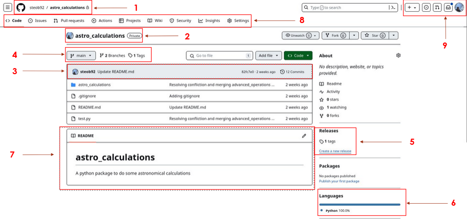
  <figcaption> Annotated GitHub repo homepage </figcaption>
</figure>

1. In the top left corner, we can see the owner and name of the repo. In this case, the owner is steob92 (me), and the name of the repo is "astro_calculations". You'll also notice a little lock icon; this signifies that the repo is a "private repo". It means that only accounts with the correct permissions can view this repo (more on this later). With the owner's account name and the name of the repo, we can quickly find the URL of the GitHub page, which takes the format `https://github.com/<owner_name>/<repo_name>/`.
2. Here we can see the name of the repo along with the owner's icon.
3. Here we see the latest update to the `main` branch. We can see that the last update was 2 weeks ago, with 12 commits pushed, made by a user with the profile name steob92, and the commit message was `Update README.md`.
4. Here we can see a snapshot of the repo. We can see that we are currently looking at the `main` branch, with two branches and 1 tagged version of the code. Clicking on the `main` icon presents a dropdown menu with the active branches, allowing us to view a different branch of the codebase.
5. Tagged versions of the code appear under the "Releases" section on the page. If we want to view different releases and download the source code for a specific release, we could click on the "1 tags" link. From here, we can also create a new tag or release of the code.
6. Here we can see a snapshot of the programming languages used within this repo. At the moment, we have a pure Python package, so this appears as 100% Python.
7. Here we can see the contents of the `README.md` file. GitHub will automatically render Markdown files when viewing them. Additionally, the `README.md` file is a special file name. If present in a folder, GitHub will render this page below the list of files present in the folder. This provides a useful way of providing documentation for users.
8. Here we can see a panel of options for the repo. We'll go through some of these options in more detail later. The important thing to remember here is that these options are specific to this repository.
9. In the top right corner, we can see notifications and the user account settings. When collaborating, we can receive notifications relating to the codebase. For example, if we're assigned to resolve an issue, we would receive a notification here. The user account settings can be accessed by clicking on the user's portrait.


## Viewing and modifying files on GitHub


We can view raw files on GitHub by clicking on them. Let's start by navigating inside the `astro_calculations` folder by clicking on it and then take a look at the `math_operations.py` file. We can now see raw Python code.

We can edit this code by clicking on the pencil icon in the top right of the panel. This changes our view to an edit mode. Let's modify the file by adding a function to convert from $km/hr$ to $m/s$:

```python linenums="1"
def convert(x):
    """Converts from km/hr to m/s

    Args:
      x: input value in km/hr to be converted Quantity

    Returns:
      x in m/s
    """
    return (x * u.km / u.hr).to("m/s")
```
We can commit this change by either hitting Ctrl+S or by clicking the `Commit changes...` button.


<figure markdown>
  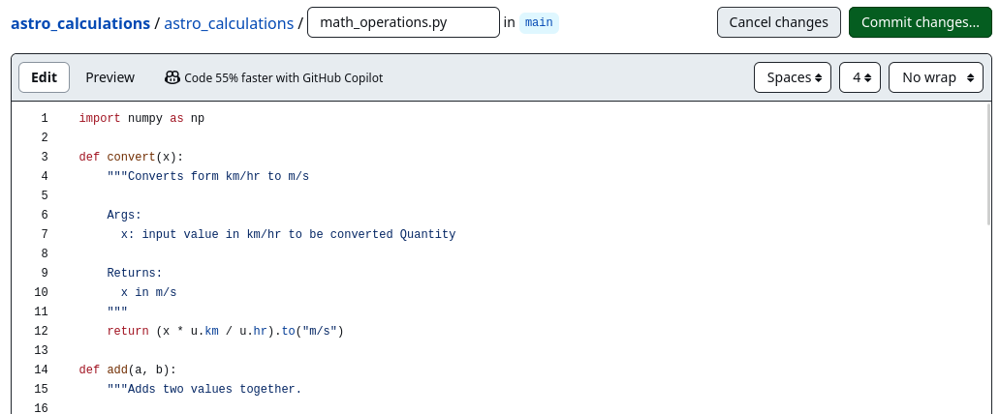
  <figcaption> Commiting changes via GitHub </figcaption>
</figure>


Doing so prompts us to write a commit message:
<figure markdown>
  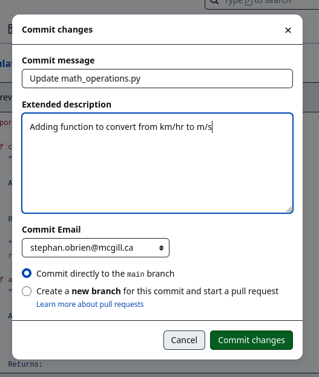
  <figcaption> Writing a commit message via Github </figcaption>
</figure>


We see that we have the option to write a more detailed commit message. 
We can also choose to commit directly to the `main` branch or create a new branch and start a "pull request". 
It is bad practice to modify the `main` branch this way; we should aim to keep the `main` branch as stable as possible, so we should create a new branch and start a pull request. 
For now, let's commit directly to the `main` branch.

With the commit now committed to the `main` branch, we can now see the following message above the code:

<figure markdown>
  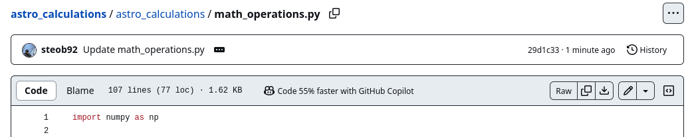
  <figcaption> Details on the latest commit is shown above the file. </figcaption>
</figure>

This tells us the latest commit to this file.
 We can also see when the commit was made (1 minute ago), the commit message (`Update math_operations.py`), and the commit ID (`29d1c33`).
 If we click on the three dots beside the commit message, we see the more detailed commit message `Adding function to convert from km/hr to m/s`.
 If we click on the commit ID (`29d1c33`), we are brought to a page which shows the previous and current versions of the code side by side, with additions and subtractions highlighted with green `+` and red `-` respectively.

<figure markdown>
  
  <figcaption> Viewing the `diff` for a commit. </figcaption>
</figure>

Below the code block, we can also have the option to comment on the commit.
This can be useful for discussing changes to the code with other collaborators.
We can write in Markdown in this comment box, with the Markdown being rendered in the preview tab.
The submitted comment will also be rendered.


## Blaming, Opening Issues and Pull Requests


### Blaming


You may have noticed that we have an error in our code. 
Specifically, the `convert` function has the line:
```python
def convert(x):
...

    return (x * u.km / u.hr).to("m/s")
```

However, `u` is never defined.
Here, we've omitted importing the `Units` class from the `astropy` package.
If we attempted to run this code, there would be an error.


For more complicated codebases, it might be difficult to debug this, so we might want to talk to the person who implemented this section of the code. 
We can open the file in GitHub and click on the line number that is causing the problem. 
This will highlight the line and present a dropdown menu accessible by clicking the three dots.

<figure markdown>
  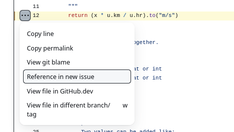
  <figcaption> Highlighting a line in GitHub </figcaption>
</figure>

There are many useful options here, but let's start by looking at the `View git blame` option:


<figure markdown>
  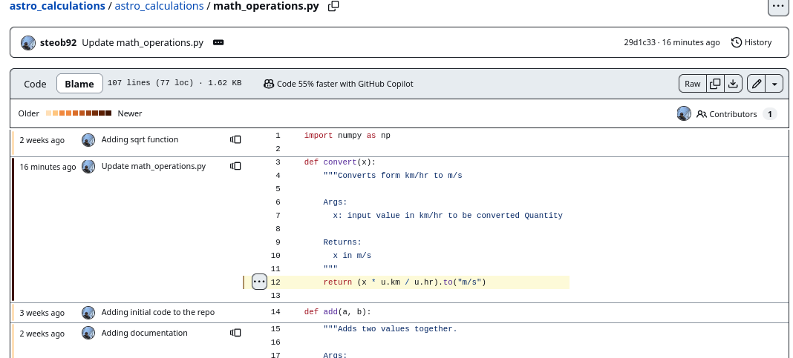
  <figcaption> Viewing `git blame` through GitHub. </figcaption>
</figure>

Here, we can see a line-by-line breakdown of the code, with each section showing when the last modification was made, along with the developer who implemented that line.

### Opening an Issue

Going back to the original code, we can click on the three dots again and select the "Reference in new issue" option.
This will bring us to a new issue, with a link to the line automatically added to the issue.
(Note: If we had used the line from the git blame page, the link would point to the git blame line.)

We can write some useful debugging information for the developers.
Since I know who should look at this problem, I am going to assign the user who last edited that line to fix the problem.
I'm also going to label this issue as a `bug`.

<figure markdown>
  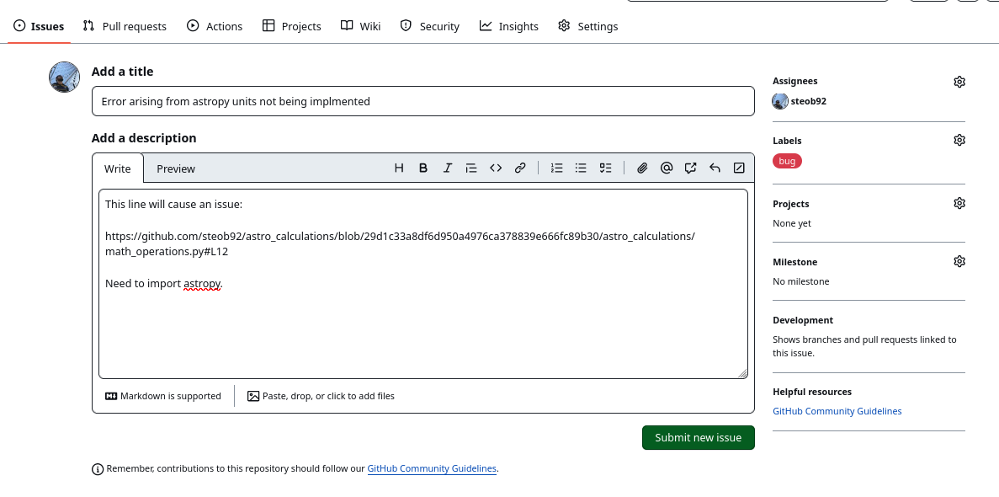
  <figcaption> Opening an issue on GitHub. </figcaption>
</figure>

Submitting this issue will take us to the issue page for this problem. 
From there, we can add additional information, comment on the issue, and close it.

By clicking on the `Issues` tab in the repository options panel, we can view all the current issues.


<figure markdown>
  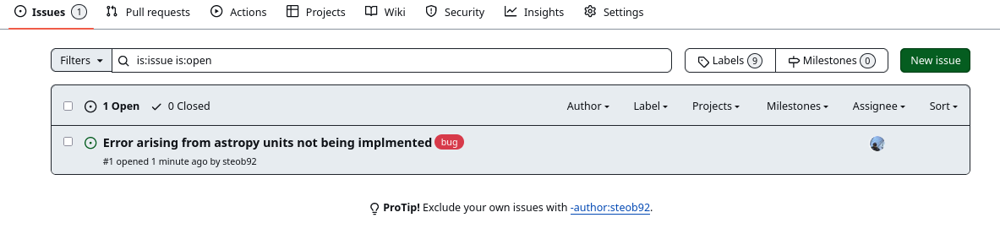
  <figcaption> Viewing current issues on GitHub. </figcaption>
</figure>

Note that the issue created has the number `#1`. Each issue will be assigned a unique ID.

Issues are a great way to communicate bugs to developers and request new features.
For example, let's say we want to request a new feature.
We can create a new issue, write a brief description of the feature, and then label the issue as an `enhancement`.
There are various options for labels, including `help wanted`, `good first issue`, and `question`.

<figure markdown>
  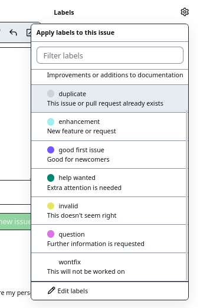
  <figcaption> Labeling issues on GitHub. </figcaption>
</figure>


Specifying labels can help encourage collaboration by specifying how new developers can contribute.

We can also add `project` and `milestone` tags to further categorize issues. 
For example, the development team might have identified specific goals for a particular version (e.g., V2.0.0, the next major release) of the code. 
Issues can be used to track the progress being made on these milestones.


### Pull Requests

In GitHub terminology, when we want to merge one branch into another branch, we open a "Pull Request".
Here, we are "requesting" that one branch pull changes from another branch.
On other platforms, this may be referred to as a "Merge Request".
As far as we need to be concerned, these are the same processes. 
We are requesting one branch to be merged into another branch.


Let's edit the code to resolve this issue. 
Instead of editing on GitHub, we'll use our local machine. 
Start by pulling the version of the code on GitHub to our local machine:
```
git-tutorial(main)» git pull                                                                 [13:13:08]
remote: Enumerating objects: 7, done.
remote: Counting objects: 100% (7/7), done.
remote: Compressing objects: 100% (4/4), done.
remote: Total 4 (delta 2), reused 0 (delta 0), pack-reused 0
Unpacking objects: 100% (4/4), 1.21 KiB | 621.00 KiB/s, done.
From github.com:steob92/astro_calculations
   82fc7e0..29d1c33  main       -> origin/main
Updating 82fc7e0..29d1c33
Fast-forward
 astro_calculations/math_operations.py | 13 ++++++++++++-
 1 file changed, 12 insertions(+), 1 deletion(-)

```

We can see that the changes have been picked up.
Let's create a new development branch:
```
git checkout -b astropy_issue                                            [13:22:48]
Switched to a new branch 'astropy_issue'
```

Let's make a few changes to the code. 
Firstly, let's add the `convert` function to our `astro_calculations/__init__.py` file so we can import it:
```python linenums="1" title="astro_calculations/__init__.py" hl_lines="1 3"
from .math_operations import add, sub, mult, div, sqrt, convert
from .printing import print_details
__all__ = ["add", "sub", "mult", "div", "sqrt", "print_details", "convert"]
```

Secondly, let's write a quick test to make sure the code will still work (`test.py`):
```python linenums="1" title="test.py" hl_lines="14 25"
import numpy as np
from astro_calculations import *

def test_ranges():

    x = 1
    y = 2
    # Testing all values between 0 and 99
    for i in range(100):
        assert(add(i,x) == i + 1)
        assert(sub(i,x) == i - 1)
        assert(mult(i,y) == i * y)
        assert(div(i,y) == i / y)
        assert(sqrt(i) == np.sqrt(i))
        assert(convert(i).value - i * 1000 / 60 / 60 < 1e-7)


def test_arrays():
    x_arr = np.array([1,2,3,4])
    y_arr = np.array([1,2,3,4])

    # Testing numpy arrays
    assert(np.all(add(x_arr, y_arr) == (x_arr + y_arr)))
    assert(np.all(sub(x_arr, y_arr) == x_arr - y_arr))
    assert(np.all(mult(x_arr, y_arr) == x_arr * y_arr))
    assert(np.all(div(x_arr, y_arr) == x_arr / y_arr))
    assert(np.all(sqrt(x_arr) == [np.sqrt(x) if x >= 0 else 0 for x in x_arr]))
    assert( (convert(x_arr).value - x_arr * 1000 / 60 / 60 < 1e-7).all())
```

Here we're converting the `astropy.Quantity` to a `float` using `.value`. 
We can run the test using `pytest`.
```
========================================================= test session starts =========================================================
platform linux -- Python 3.10.10, pytest-7.2.2, pluggy-1.0.0
rootdir: /raid/RAID1/Tutorials/git-tutorial
collected 0 items / 1 error                                                                                                           

=============================================================== ERRORS ================================================================
______________________________________________________ ERROR collecting test.py _______________________________________________________
test.py:14: in <module>
    assert(convert(i) == i * 1000 / 60 / 60)
astro_calculations/math_operations.py:12: in convert
    return (x * u.km / u.hr).to("m/s")
E   NameError: name 'u' is not defined
======================================================= short test summary info =======================================================
ERROR test.py - NameError: name 'u' is not defined
!!!!!!!!!!!!!!!!!!!!!!!!!!!!!!!!!!!!!!!!!!!!!!! Interrupted: 1 error during collection !!!!!!!!!!!!!!!!!!!!!!!!!!!!!!!!!!!!!!!!!!!!!!!!
========================================================== 1 error in 0.87s ===========================================================
```

Let's modify astro_calculations/math_operations.py to fix the import bug:
```python title="astro_calculations/math_operations.py" linenums="1" hl_lines="2"
import numpy as np
from astropy import units as u

def convert(x):
    ...
```

`pytest` should no longer report any errors. With these changes made we can commit the changes.

```
git add .
```

And commit with a useful message, adding the issue number to the commit message:
```
git commit -m "Adding astropy import to resolve issue #1"  [13:41:24]
[astropy_issue 50a9db3] Adding astropy import to resolve issue #1
 3 files changed, 6 insertions(+), 2 deletions(-)
```

Typing `git push` will inform us that there is no upstream branch:
```
fatal: The current branch astropy_issue has no upstream branch.
To push the current branch and set the remote as upstream, use

    git push --set-upstream origin astropy_issue
```

Using the helpful message (in case we ever forget it!) we can add the upstream when pushing:
```
git push --set-upstream origin astropy_issue                 [13:42:19]

Enumerating objects: 11, done.
Counting objects: 100% (11/11), done.
Delta compression using up to 16 threads
Compressing objects: 100% (6/6), done.
Writing objects: 100% (6/6), 751 bytes | 751.00 KiB/s, done.
Total 6 (delta 3), reused 0 (delta 0), pack-reused 0
remote: Resolving deltas: 100% (3/3), completed with 3 local objects.
remote: 
remote: Create a pull request for 'astropy_issue' on GitHub by visiting:
remote:      https://github.com/steob92/astro_calculations/pull/new/astropy_issue
remote: 
To github.com:steob92/astro_calculations.git
 * [new branch]      astropy_issue -> astropy_issue
Branch 'astropy_issue' set up to track remote branch 'astropy_issue' from 'origin'.

```

Switching back to GitHub, we can now see that the issue has been updated to indicate that the commit referenced this issue.


<figure markdown>
  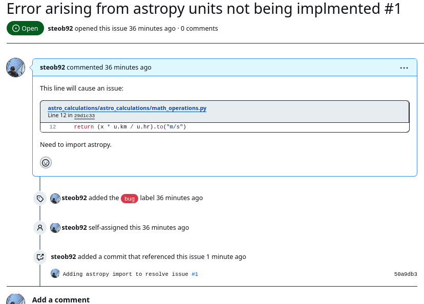
  <figcaption> Referencing issues in commit messages on GitHub. </figcaption>
</figure>

After some testing and discussion, we might decide that this change resolves all the issues, so we want to merge the changes into the `main` branch. 
To do this, we can navigate to the `Pull Request` tab in the top panel:

<figure markdown>
  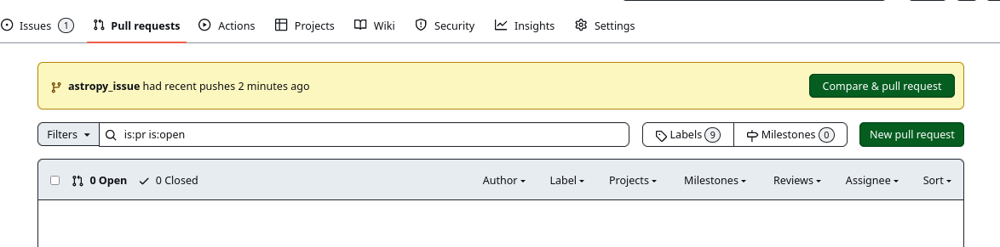
  <figcaption> Opening a pull request. </figcaption>
</figure>

We can see that there is a highlighted option at the top allowing us to merge in the fastest request.
This won't always be the branch we want to merge, so let's do it the manual way by clicking `New pull request`.
Using the drop-down menu, we can select which branches we want to merge.
The arrow indicates which branch is being merged into which.
In the below example, the `astropy_issue` branch is to be merged into the `main`.


<figure markdown>
  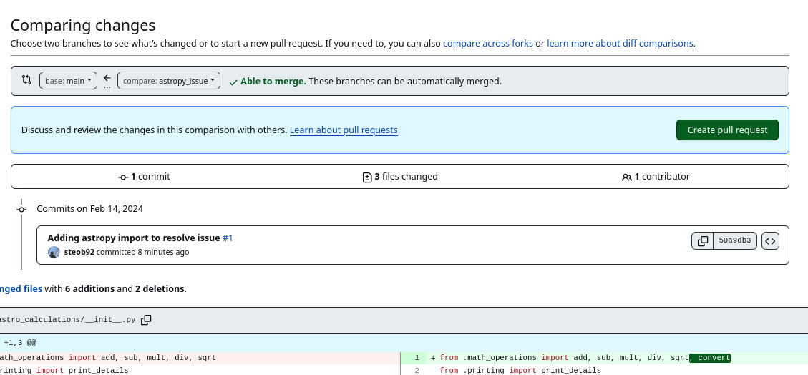
  <figcaption> Labeling issues on GitHub. </figcaption>
</figure>
Clicking `Create pull request` brings us to a page to add a description. 
We can add a helpful description and create the request.

We can always see open pull requests by clicking on the `Pull requests` tab on the repository options panel:


<figure markdown>
  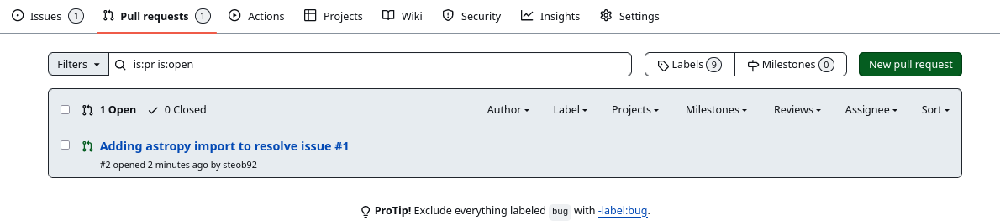
  <figcaption> Open pull requests. </figcaption>
</figure>
When clicking on an open pull request, we are provided with a wealth of additional information:


<figure markdown>
  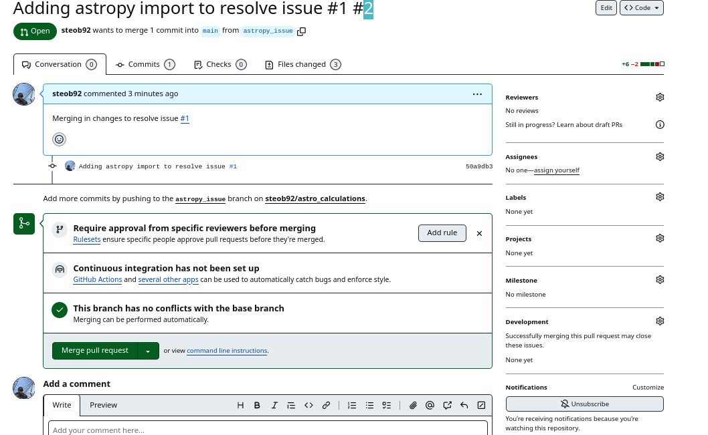
  <figcaption> Page for an individual pull request. </figcaption>
</figure>
GitHub will check if the merge can happen as is, or if there are conflicts that need to be resolved.
Like issues, we can also assign developers, `labels`, `projects`, etc.
It is common to require a code review before accepting a pull/merge request.
Once we're happy, we can approve the merge request by clicking `Merge pull request`, add a comment if needed, and click `Confirm merge`.
Once merged, we can delete the branch that was just merged.


## Tagging Versions

With a new feature added to the code, it might be time to release a new version of the code. 
To do this, we'll use the `Create a new release` button on the repository home page:

<figure markdown>
  
  <figcaption> GitHub releases. </figcaption>
</figure>
From here, we can set a `tag` or version number, set the target (for example, the `main` branch), and set the previous `tag`:

<figure markdown>
  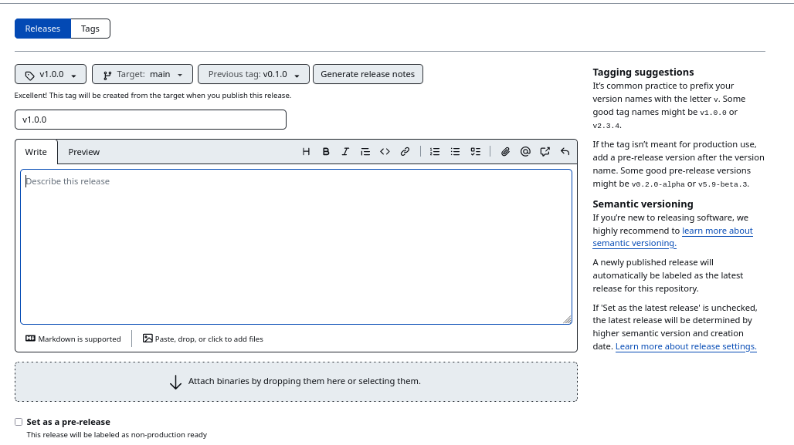
  <figcaption> GitHub release page. </figcaption>
</figure>
We can use the `Generate release notes` option to automatically create a set of notes for the new release. 
This tells the user what has changed between the new release and the previous tag. 
GitHub will generate these notes from the commit messages. 
When we're happy with the description of the new release, we can click `Publish release`.

This brings us to a release page for the tag:

<figure markdown>
  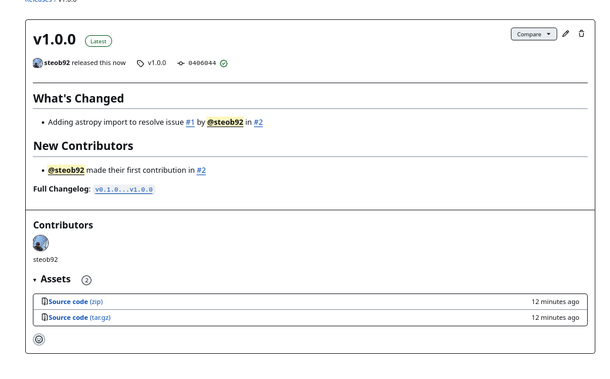
  <figcaption> Generated change log and release page. </figcaption>
</figure>
This contains lots of useful information like what has changed since the previous release, new contributors, and who contributed to this release. 
Additionally, a copy of the source code is available for download.


From our local machine, we can retrieve all the releases using the following command:
```
git fetch --tags
```
We can list available tags with:
```
git tag
```
and checkout the v1.0.0 tag with:
```
git checkout tags/v1.0.0
```

Using tagged versions allows us to control which version of the code is being used.
Tags serve as markers or labels for specific points in the repository's history, typically representing stable releases, major milestones, or significant changes.
They provide a convenient way to reference and track specific versions of the codebase, facilitating reproducibility, collaboration, and deployment workflows.


## Using GitHub to Streamline Workflow with GitHub Actions

When maintaining a project with multiple developers and users, it's crucial to ensure that one developer doesn't introduce code-breaking features.
We've already explored how to use `pytest` to run a set of tests locally.
However, we can leverage "GitHub Actions" to automate workflows triggered by specific events.


For instance, let's consider ensuring that our `main` branch only contains code that works without any errors.
We could define a series of tests that must be passed before pushing changes to the `main` branch.
While we could enforce a policy requiring all developers to run these tests before pushing changes, human error or forgetfulness can occur.
Instead, we can set up a "GitHub Action" to trigger automatically whenever a `push` attempt is made to the `main` branch.


Firstly, let's clarify the dependencies required to compile and run the code.
For new developers attempting to run the code in a new environment, they'll need a list of required packages to install.
We can define these dependencies in a requirements file:

```title="requirements.txt"
numpy
astropy
```
We only have two external packages, `numpy` and `astropy`. To install them, one would run the following command:
```
pip install -r requirements.txt
```

Commit and push this file to `main`.


Next, on GitHub, click on the `Actions` tab on the repository options panel.
If this is our first action, we'll see a page like this:

<figure markdown>
  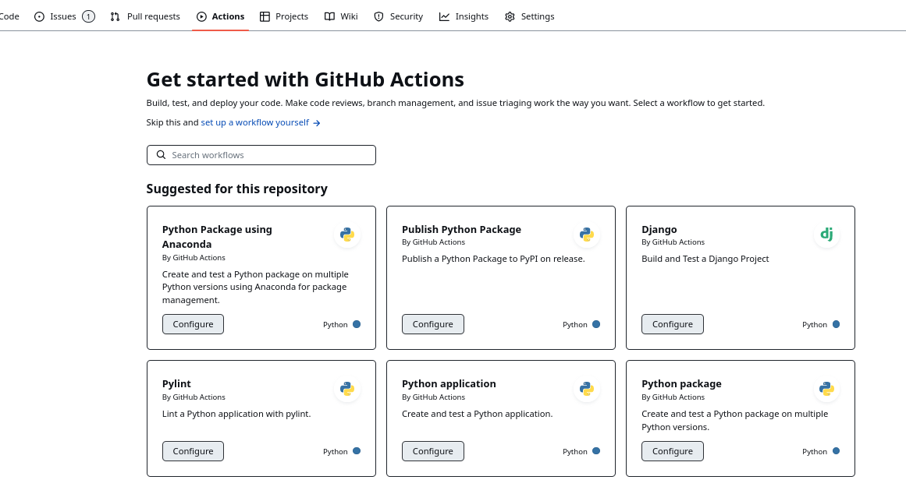
  <figcaption> Setting up our first GitHub Action. </figcaption>
</figure>

There are lots of pre-made actions available to choose from.
We'll take a pre-made action for now and revisit setting up our own workflow in a future tutorial.
Let's select the `Python package` action by clicking `Configure` on that action's card.
This will bring us to a new page with a pre-generated YAML file:

```yaml title="python-package.yml" linenums="1" hl_lines="4 6-10 15 19 21 27 29-31 32 35 37 40"
# This workflow will install Python dependencies, run tests and lint with a variety of Python versions
# For more information see: https://docs.github.com/en/actions/automating-builds-and-tests/building-and-testing-python

name: Python package

on:
  push:
    branches: [ "main" ]
  pull_request:
    branches: [ "main" ]

jobs:
  build:

    runs-on: ubuntu-latest
    strategy:
      fail-fast: false
      matrix:
        python-version: ["3.9", "3.10", "3.11"]

    steps:
    - uses: actions/checkout@v3
    - name: Set up Python ${{ matrix.python-version }}
      uses: actions/setup-python@v3
      with:
        python-version: ${{ matrix.python-version }}
    - name: Install dependencies
      run: |
        python -m pip install --upgrade pip
        python -m pip install flake8 pytest
        if [ -f requirements.txt ]; then pip install -r requirements.txt; fi
    - name: Lint with flake8
      run: |
        # stop the build if there are Python syntax errors or undefined names
        flake8 . --count --select=E9,F63,F7,F82 --show-source --statistics
        # exit-zero treats all errors as warnings. The GitHub editor is 127 chars wide
        flake8 . --count --exit-zero --max-complexity=10 --max-line-length=127 --statistics
    - name: Test with pytest
      run: |
        pytest test.py

```
Let's break this down:
- On line 4, we define the name of the test as `Python package`.
- On lines 6-10, we define the actions to trigger (`push` and `pull_request`) and the branches to trigger on (`main`). This specific action will trigger on any `push` or `pull_request` to the `main` branch.
- On line 15, we specify the container to run our tests on. Here, we use `ubuntu-latest`, representing the latest version of the Ubuntu Linux OS.
- On line 19, we define a list of Python versions to test the code against.
- From line 21 onwards, we define the steps of the action.
- On lines 27-31, we define the `Install dependencies` step, which installs and upgrades `pip` on line 29, and installs `flake8` and `pytest` using the `requirements.txt` file on line 31.
- On lines 32-37, we perform linting using the `flake8` command, which tests the code for bugs and formatting issues.
- On lines 38-40, we run `pytest`.
- I've modified line 40 to include the name of the test file (`test.py`).

This file is saved to `.github/workflows/python-package.yml`. Now, let's try creating a new branch with some new code.

```
git checkout -b new_feature 
```

Modify some file to include a new dependency:
```python title="astro_calculations/math_operations.py" linenums="1" hl_lines="3"
import numpy as np
from astropy import units as u
from scipy import optimize

def convert(x):
    ...
```

Commit and push this new branch:
```
git commit -m "adding new dependency"
git push --set-upstream origin new_feature
```

From GitHub, we can now create a pull request from this new branch. 
After some time, we'll notice that the pull request to `main` triggered our action, and this action has failed the checks.

<figure markdown>
  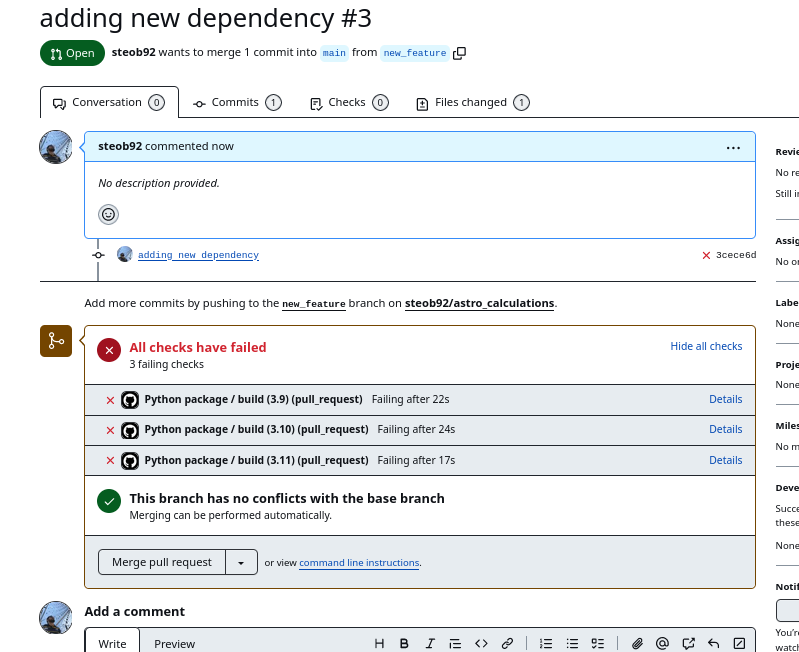
  <figcaption> (Failed) GitHub actions triggered by a pull request show up on the pull request page. </figcaption>
</figure>

By clicking on the details link, we can see what caused the pull request to fail:

<figure markdown>
  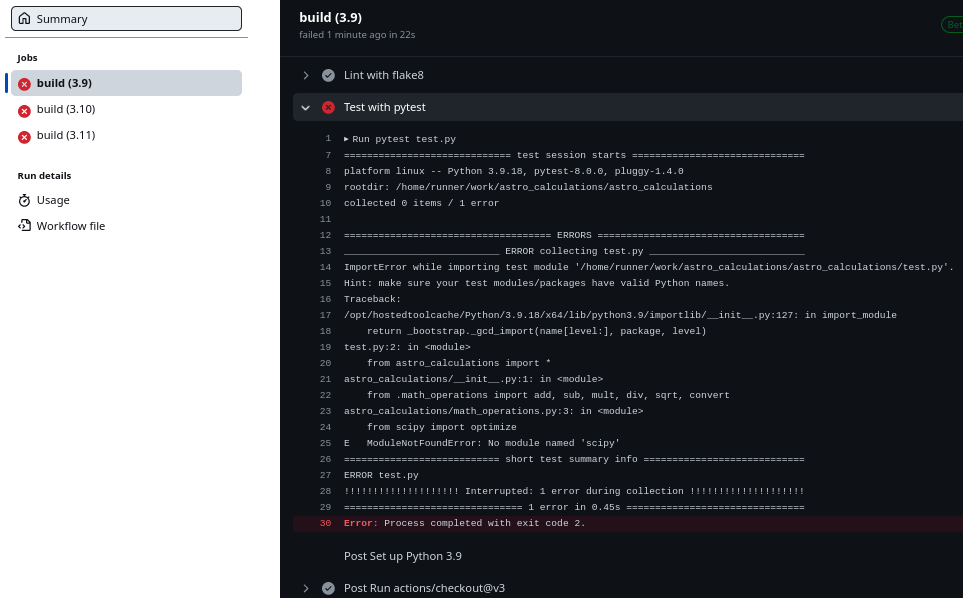
  <figcaption> Details of the failed workflow. </figcaption>
</figure>

The action failed because we forgot to add `scipy` to the `requirements.txt` file. 
If we make these changes and commit them to the same branch, these changes will automatically be tested.

<figure markdown>
  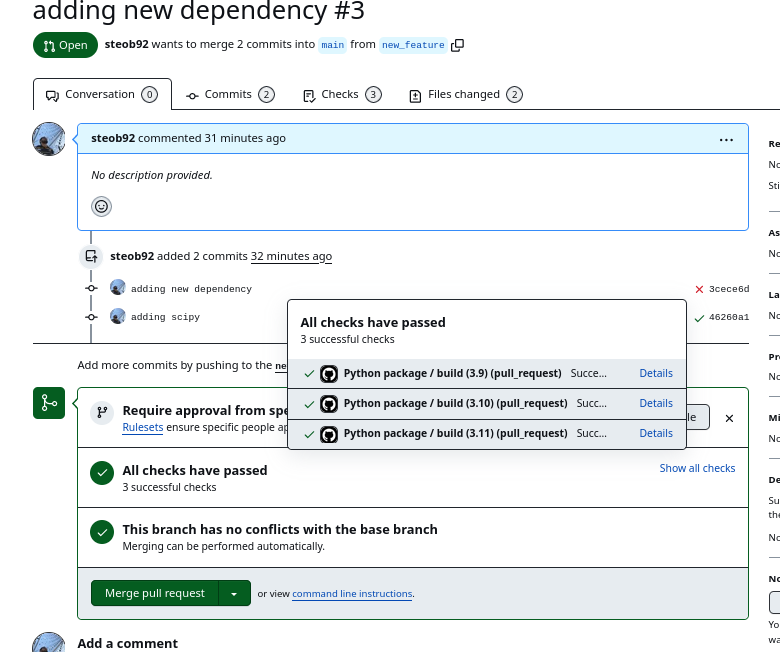
  <figcaption> Successful workflow showing up under the pull request. </figcaption>
</figure>

We can see that the latest commit ('adding scipy') passes all the tests, allowing us to merge the pull request knowing that we haven't introduced any new bugs to our code.

By using GitHub Actions to automatically test our code, we have adopted a DevOps development practice known as "Continuous Integration" (CI).
Continuous Integration involves continuously integrating code changes into a shared repository, where automated tests are run to detect integration errors and ensure code quality.
This approach helps teams catch and fix bugs early in the development process, leading to faster delivery of high-quality software.

In the [next tutorial](./git_3.md), we'll delve deeper into Continuous Integration methods and practices and explore how we can leverage GitHub Actions and other tools to further improve our code quality and development workflow.


<script id="MathJax-script" async src="https://cdn.jsdelivr.net/npm/mathjax@3/es5/tex-mml-chtml.js"></script>