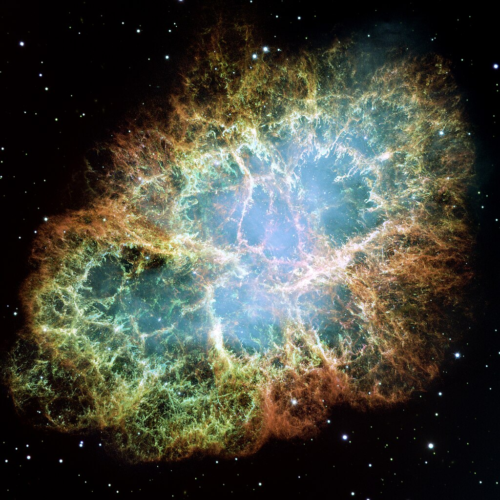

# Welcome to My Research Page

{align="left": style="height:150;width:150px"}
Welcome to the digital platform of a dedicated physics graduate student committed to unraveling the intricacies of the cosmos. 
Focused on the exploration of the profound Crab Nebula, a celestial phenomenon steeped in historical fascination, my research endeavors center on the application of advanced astrophysical methodologies and theoretical frameworks. 
This platform serves as an invitation to accompany me on a scholarly journey into the depths of the universe. 
Through meticulous investigation, I aim to elucidate the fundamental processes shaping the Crab Nebula, contributing substantively to the broader comprehension of the universe's extraordinary phenomena. 
I extend a formal welcome to all who wish to engage with the frontiers of astrophysics through the lens of my ongoing research endeavors.

If you're like to learn more about me, you can find an introduction to [my research](./reasearch/research_index.md), some info on some [recent projects](./projects/project_index.md) and some more info [about me](./about/about.md).

## Here is an equation

$$ x = \frac{-b \pm \sqrt{b^2 -4ac}}{2a}$$

## Here is the Crab Nebula

I got this image from [Wikipedia](https://en.wikipedia.org/wiki/Crab_Nebula).