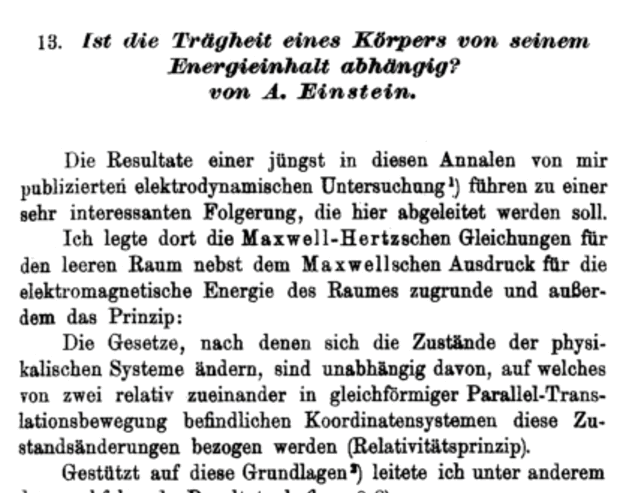

# Awesome Paper

Here is a brief summary of my awesome paper which is published [here](https://onlinelibrary.wiley.com/doi/10.1002/andp.19053231314). 
In this paper I postulate if the Inertia of an object Depend Upon Its Energy Content?
It is found that:

$$E = mc^2$$

Here is an interesting figure from this paper:

