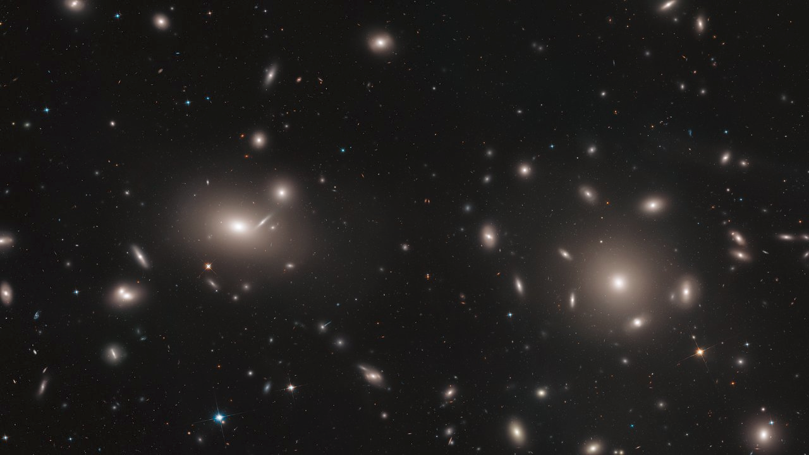

# Multiwavelength Paper

In this multiwavelength paper, I use data from [VERITAS](https://veritas.sao.arizona.edu/), [Swift](https://www.swift.ac.uk/) and [CHIME](https://chime-experiment.ca/en), to study the equivalencies of sample galaxies when investigating instrumental systematic. Applying [Keeler's theorem](https://theinfosphere.org/Futurama_theorem) ([see also](https://medium.com/@mikaeldavidsson/the-futurama-theorem-103980db677b)) it can be shown that convergence is quickly obtained, requiring at minimum two additional sample galaxies.

<figure markdown>
  {: style="height:300px;width:500px"}
  <!-- Within fig caption normal markdown linking doesn't work, instead use a href attribute -->
  <figcaption>Centered and resized image of the Coma Cluster (source <a href="https://esahubble.org/images/potw1849a/">ESA</a>) </figcaption>
</figure>
